---
## Front matter
lang: ru-RU
title: Презентация по лабораторной работе №1
subtitle: "Методы кодирования и модуляция сигналов"
author:
  - Галацан Николай
institute:
  - Российский университет дружбы народов, Москва, Россия

## i18n babel
babel-lang: russian
babel-otherlangs: english

## Formatting pdf
toc: false
toc-title: Содержание
slide_level: 2
aspectratio: 169
section-titles: true
theme: metropolis
header-includes:
 - \metroset{progressbar=frametitle,sectionpage=progressbar,numbering=fraction}
 - '\makeatletter'
 - '\beamer@ignorenonframefalse'
 - '\makeatother'
---

## Докладчик

  * Галацан Николай
  * 1032225763
  * уч. группа: НПИбд-01-22
  * Факультет физико-математических и естественных наук
  * Российский университет дружбы народов

## Цели и задачи

Изучение методов кодирования и модуляции сигналов с помощью высокоуровнего языка программирования Octave. Определение спектра и параметров сигнала. Демонстрация принципов модуляции сигнала на примере аналоговой
амплитудной модуляции. Исследование свойства самосинхронизации сигнала.

# Построение графиков в Octave

## Выполнение лабораторной работы

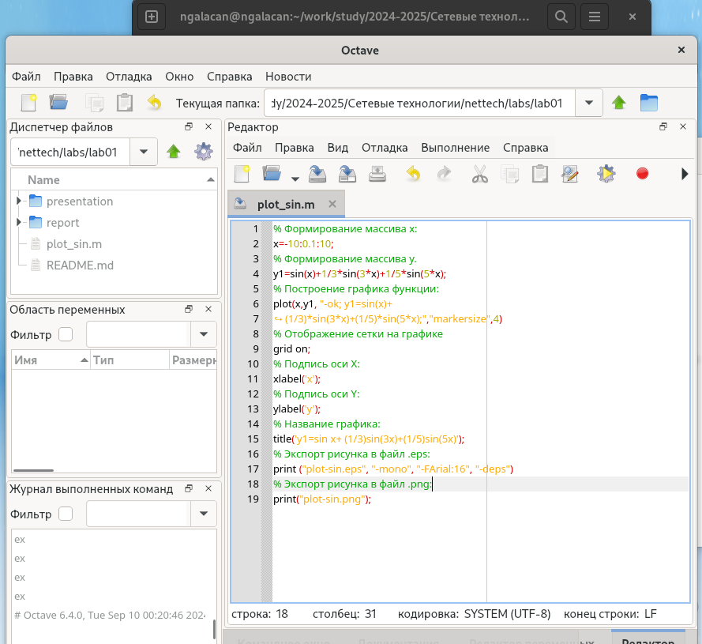{#fig:1 width=50%}

## Выполнение лабораторной работы

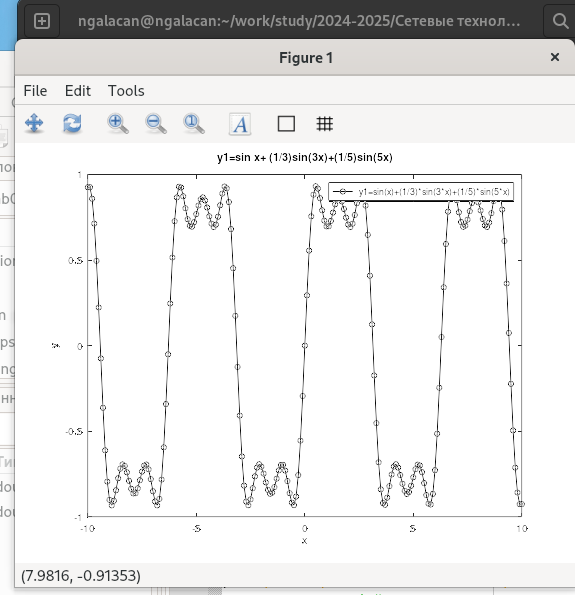{#fig:2 width=40%}

## Выполнение лабораторной работы

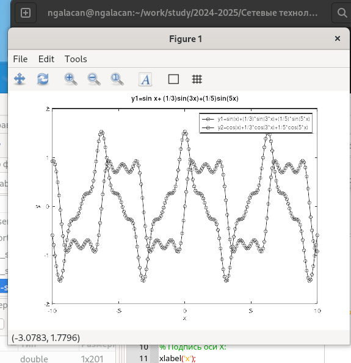{#fig:3 width=40%}

# Разложение импульсного сигнала в частичный ряд Фурье

## Выполнение лабораторной работы

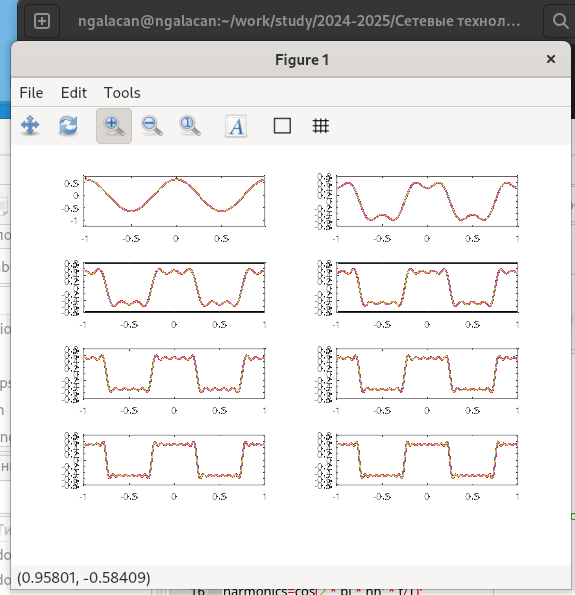{#fig:4 width=40%}

## Выполнение лабораторной работы

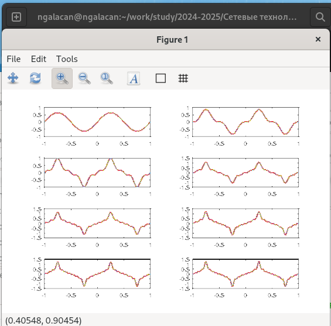{#fig:5 width=40%}

# Определение спектра и параметров сигнала

## Выполнение лабораторной работы

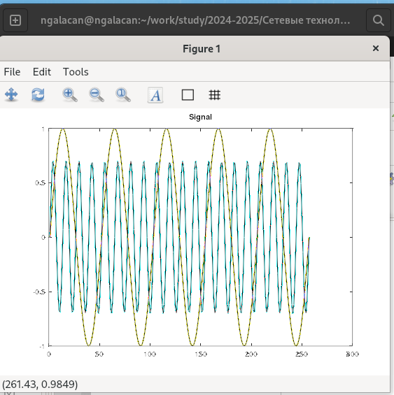{#fig:6 width=50%}

## Выполнение лабораторной работы

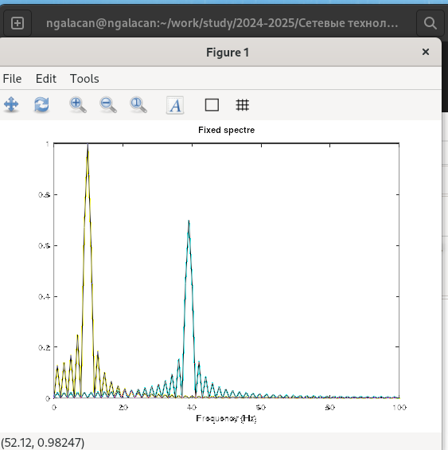{#fig:7 width=50%}

## Выполнение лабораторной работы

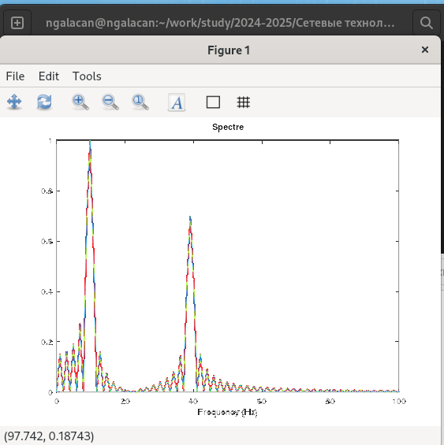{#fig:8 width=50%}

# Амплитудная модуляция

## Выполнение лабораторной работы

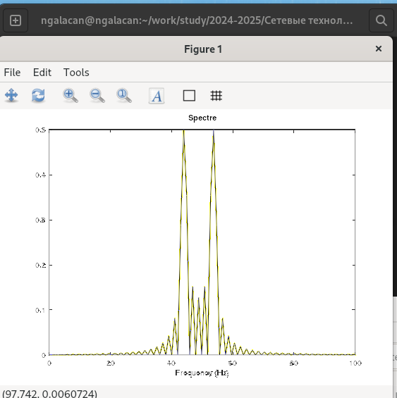{#fig:9 width=50%}

# Кодирование сигнала. Исследование свойства самосинхронизации сигнала

## Выполнение лабораторной работы

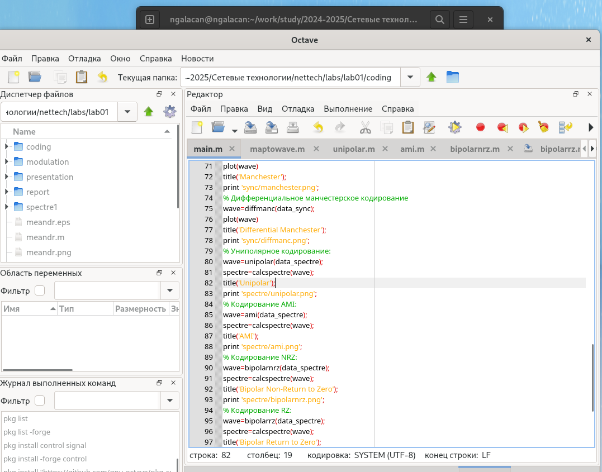{#fig:10 width=50%}

## Выполнение лабораторной работы

{#fig:11 width=50%}

## Выполнение лабораторной работы

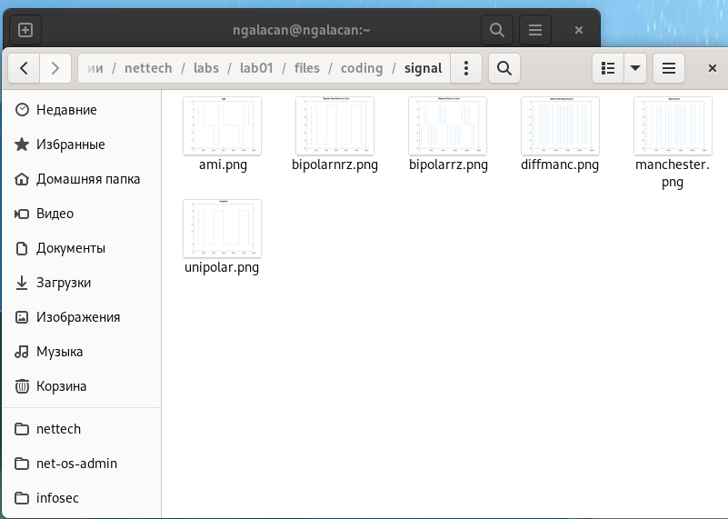{#fig:12 width=50%}

## Выполнение лабораторной работы

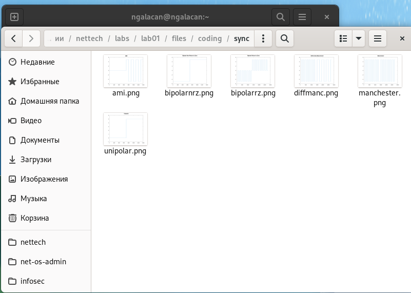{#fig:13 width=50%}

## Выполнение лабораторной работы

{#fig:14 width=50%}

## Выводы

Изучены методы кодирования и модуляции сигналов с помощью высокоуровнего языка программирования Octave. Изучено определение спектра и параметров сигнала. Произведена демонстрация принципов модуляции сигнала на примере аналоговой амплитудной модуляции. Исследованы свойства самосинхронизации сигнала.

