---
## Front matter
title: "Отчет по лабораторной работе №1"
subtitle: "Методы кодирования и модуляция сигналов"
author: "Галацан Николай, НПИбд-01-22"

## Generic otions
lang: ru-RU
toc-title: "Содержание"

## Bibliography
bibliography: bib/cite.bib
csl: pandoc/csl/gost-r-7-0-5-2008-numeric.csl

## Pdf output format
toc: true # Table of contents
toc-depth: 2
lof: true # List of figures
lot: false # List of tables
fontsize: 12pt
linestretch: 1.5
papersize: a4
documentclass: scrreprt
## I18n polyglossia
polyglossia-lang:
  name: russian
  options:
	- spelling=modern
	- babelshorthands=true
polyglossia-otherlangs:
  name: english
## I18n babel
babel-lang: russian
babel-otherlangs: english
## Fonts
mainfont: IBM Plex Serif
romanfont: IBM Plex Serif
sansfont: IBM Plex Sans
monofont: IBM Plex Mono
mathfont: STIX Two Math
mainfontoptions: Ligatures=Common,Ligatures=TeX,Scale=0.94
romanfontoptions: Ligatures=Common,Ligatures=TeX,Scale=0.94
sansfontoptions: Ligatures=Common,Ligatures=TeX,Scale=MatchLowercase,Scale=0.94
monofontoptions: Scale=MatchLowercase,Scale=0.94,FakeStretch=0.9
mathfontoptions:
## Biblatex
biblatex: true
biblio-style: "gost-numeric"
biblatexoptions:
  - parentracker=true
  - backend=biber
  - hyperref=auto
  - language=auto
  - autolang=other*
  - citestyle=gost-numeric
## Pandoc-crossref LaTeX customization
figureTitle: "Рис."
tableTitle: "Таблица"
listingTitle: "Листинг"
lofTitle: "Список иллюстраций"
lotTitle: "Список таблиц"
lolTitle: "Листинги"
## Misc options
indent: true
header-includes:
  - \usepackage{indentfirst}
  - \usepackage{float} # keep figures where there are in the text
  - \floatplacement{figure}{H} # keep figures where there are in the text
---

# Цель работы

Изучение методов кодирования и модуляции сигналов с помощью высокоуровнего языка программирования Octave. Определение спектра и параметров сигнала. Демонстрация принципов модуляции сигнала на примере аналоговой
амплитудной модуляции. Исследование свойства самосинхронизации сигнала.

# Выполнение лабораторной работы

## Построение графиков в Octave

Построю график функции $$ y=sin(x)+\frac{1}{3}sin(3x)+\frac{1}{5}sin(5x) $$ на интервале
[−10; 10], используя Octave и функцию `plot`. Создаю файл `plot_sin.m` (рис. [-@fig:1]).

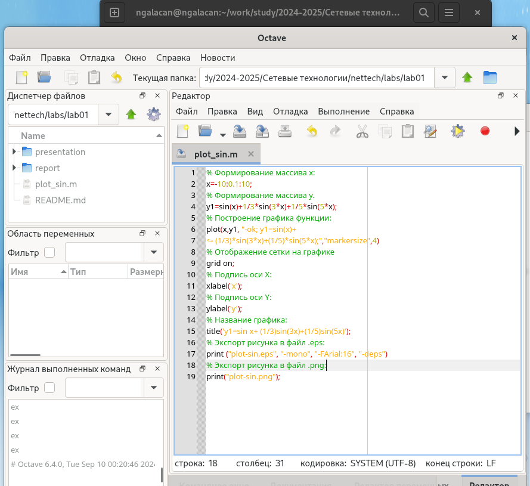{#fig:1 width=70%}

Запускаю файл и получаю график (рис. [-@fig:2]). В рабочем каталоге появляются файлы с графиками в форматах .eps, .png.

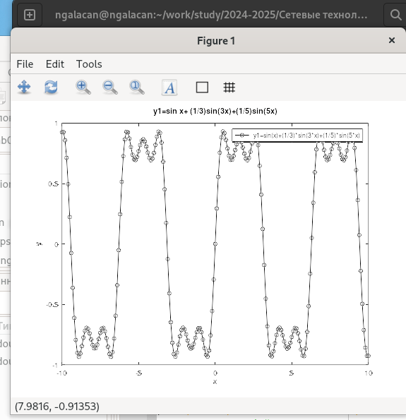{#fig:2 width=70%}

Сохраняю файл под другим именем, добавляю на график линию $$ y2=cos(x)+\frac{1}{3}cos(3x)+\frac{1}{5}cos(5x) $$ и запускаю (рис. [-@fig:3]) 

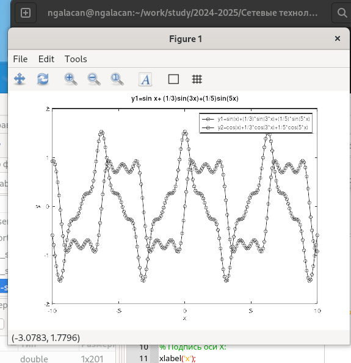{#fig:3 width=70%}

## Разложение импульсного сигнала в частичный ряд Фурье

Создаю сценарий `meandr.m` для демонстрации графиков меандра, реализованных с разным количеством гармоник (рис. [-@fig:4])

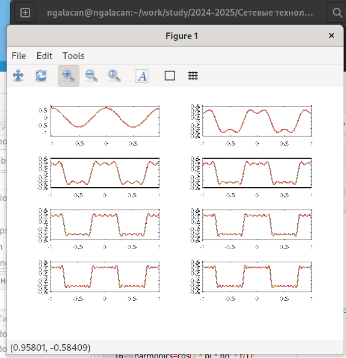{#fig:4 width=70%}

Добавляю в листинг строки для экспорта графика в .png. Корректирую код для реализации меандра через синусы (рис. [-@fig:5])

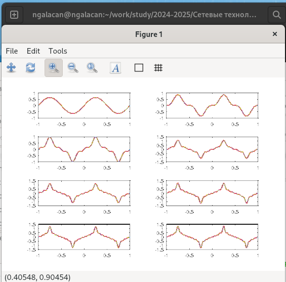{#fig:5 width=70%}

## Определение спектра и параметров сигнала

Определю спектр двух отдельных сигналов и их суммы. В рабочем каталоге создаю каталог `spectre1` и в нём новый сценарий с именем `spectre.m`. Запускаю сценарий (рис. [-@fig:6]) 

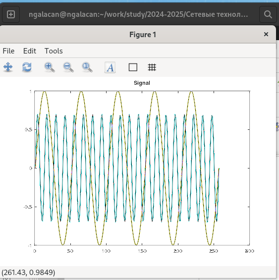{#fig:6 width=70%}

Нахожу спектры сигналов с помощью быстрого преобразования Фурье. Корректирую график спектра  (рис. [-@fig:7])

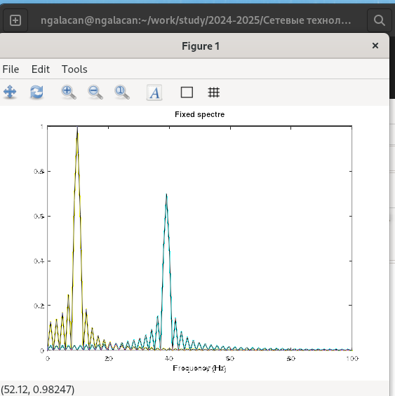{#fig:7 width=70%}

Нахожу спектр суммы рассмотренных сигналов, создав каталог `spectr_sum` и файл в нём `spectre_sum.m`. В результате получается аналогичный предыдущему результат, т.е. спектр суммы сигналов должен быть равен сумме спектров сигналов, что вытекает из свойств преобразования Фурье (рис. [-@fig:8])

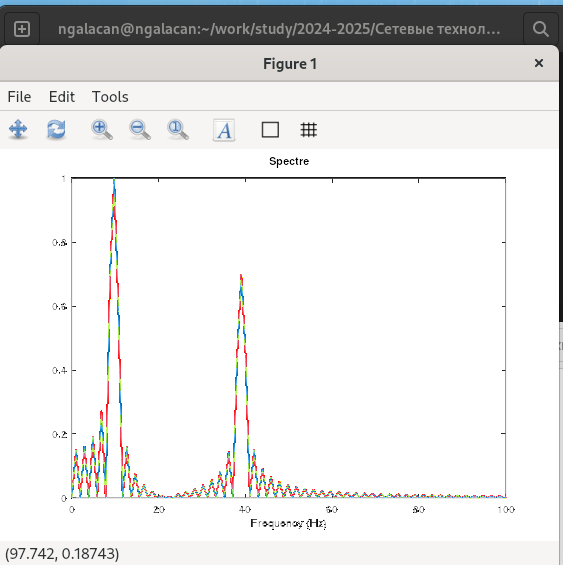{#fig:8 width=70%}

## Амплитудная модуляция

Cоздаю каталог `modulation` и в нём новый сценарий с именем `am.m.` для демонстрации принципов модуляции сигнала на примере аналоговой амплитудной модуляции. В результате получаю, что спектр произведения представляет собой свёртку спектров (рис. [-@fig:9]).

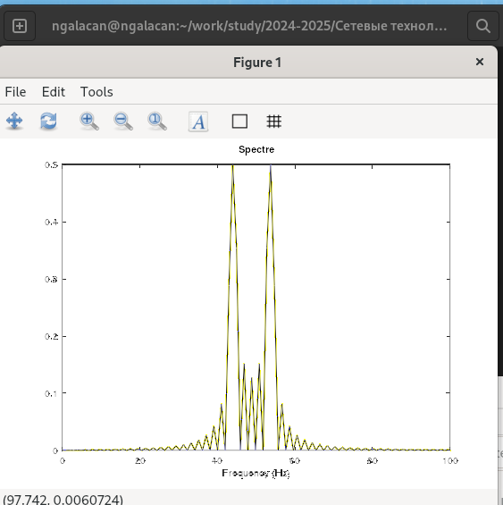{#fig:9 width=70%}


## Кодирование сигнала. Исследование свойства самосинхронизации сигнала

В рабочем каталоге создаю каталог `coding` и в нём файлы `main.m, maptowave.m, unipolar.m ,ami.m, bipolarnrz.m, bipolarrz.m, manchester.m, diffmanc.m, calcspectre.m.` и ввожу код (рис. [-@fig:10]).

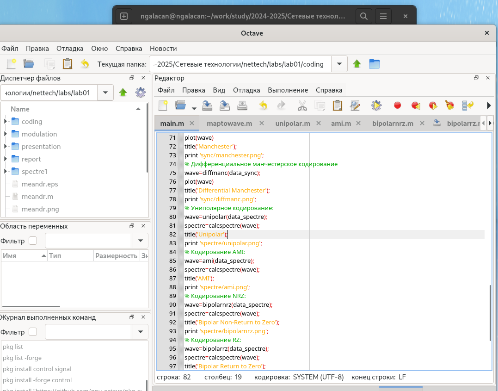{#fig:10 width=70%}

Устанавливаю пакет расширений `signal` (рис. [-@fig:11]):
```
pkg list -forge
pkg install -forge control
pkg install -forge signal
```

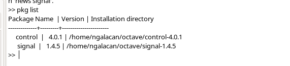{#fig:11 width=70%}

Запустив файл `main.m`, получаю графики. В каталоге `signal` получены файлы с графиками кодированного сигнала (рис. [-@fig:12]), в каталоге sync — файлы с графиками, иллюстрирующими свойства самосинхронизации
(рис. [-@fig:13]), в каталоге spectre — файлы с графиками спектров сигналов (рис. [-@fig:14]).


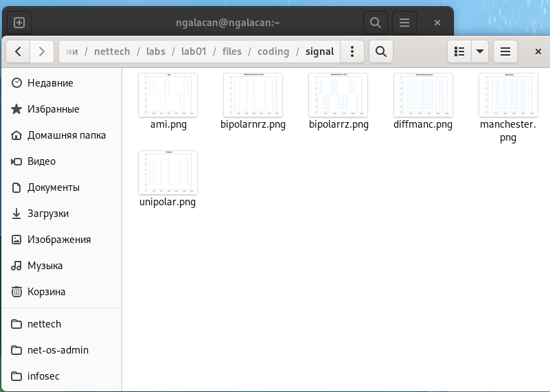{#fig:12 width=70%}

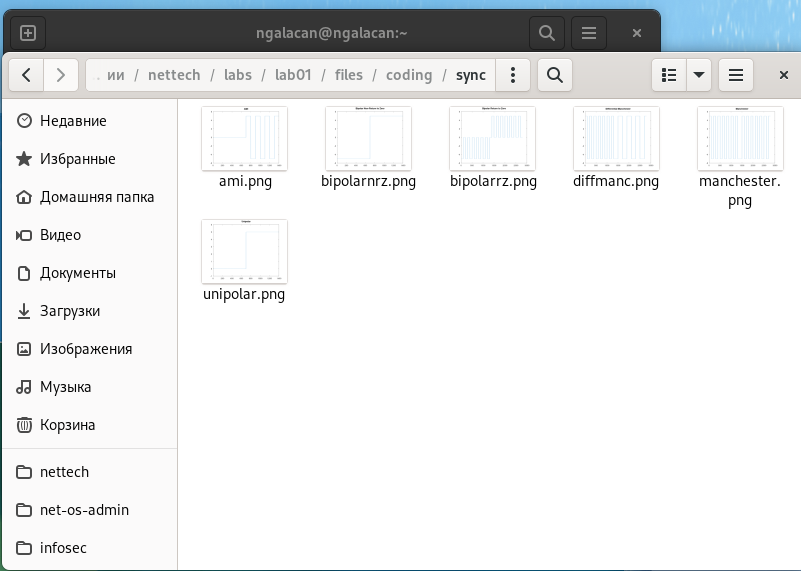{#fig:13 width=70%}

{#fig:14 width=70%}

# Выводы

Изучены методы кодирования и модуляции сигналов с помощью высокоуровнего языка программирования Octave. Изучено определение спектра и параметров сигнала. Произведена демонстрация принципов модуляции сигнала на примере аналоговой амплитудной модуляции. Исследованы свойства самосинхронизации сигнала.
