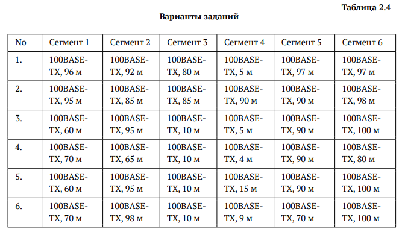
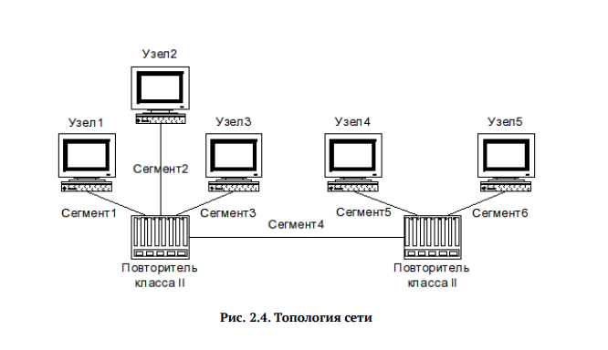
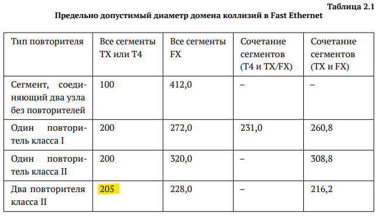
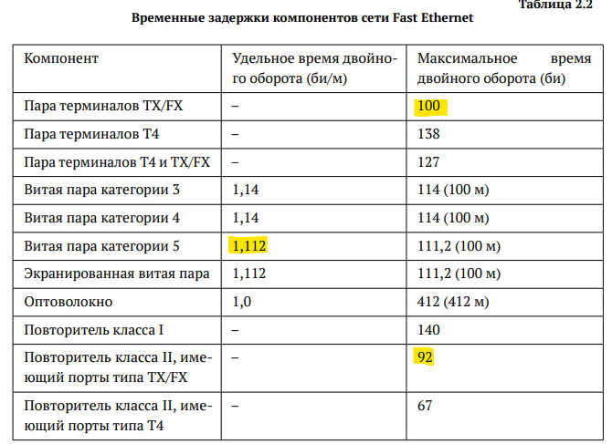
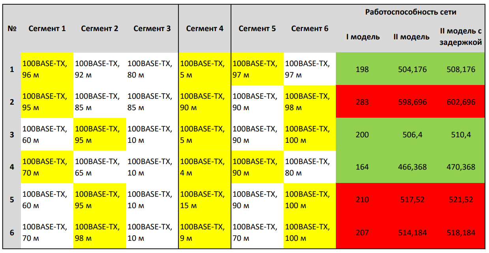

---
## Front matter
title: "Отчет по лабораторной работе №2"
subtitle: "Расчёт сети Fast Ethernet"
author: "Галацан Николай, НПИбд-01-22"

## Generic otions
lang: ru-RU
toc-title: "Содержание"

## Bibliography
bibliography: bib/cite.bib
csl: pandoc/csl/gost-r-7-0-5-2008-numeric.csl

## Pdf output format
toc: true # Table of contents
toc-depth: 2
lof: true # List of figures
lot: false # List of tables
fontsize: 12pt
linestretch: 1.5
papersize: a4
documentclass: scrreprt
## I18n polyglossia
polyglossia-lang:
  name: russian
  options:
	- spelling=modern
	- babelshorthands=true
polyglossia-otherlangs:
  name: english
## I18n babel
babel-lang: russian
babel-otherlangs: english
## Fonts
mainfont: IBM Plex Serif
romanfont: IBM Plex Serif
sansfont: IBM Plex Sans
monofont: IBM Plex Mono
mathfont: STIX Two Math
mainfontoptions: Ligatures=Common,Ligatures=TeX,Scale=0.94
romanfontoptions: Ligatures=Common,Ligatures=TeX,Scale=0.94
sansfontoptions: Ligatures=Common,Ligatures=TeX,Scale=MatchLowercase,Scale=0.94
monofontoptions: Scale=MatchLowercase,Scale=0.94,FakeStretch=0.9
mathfontoptions:
## Biblatex
biblatex: true
biblio-style: "gost-numeric"
biblatexoptions:
  - parentracker=true
  - backend=biber
  - hyperref=auto
  - language=auto
  - autolang=other*
  - citestyle=gost-numeric
## Pandoc-crossref LaTeX customization
figureTitle: "Рис."
tableTitle: "Таблица"
listingTitle: "Листинг"
lofTitle: "Список иллюстраций"
lotTitle: "Список таблиц"
lolTitle: "Листинги"
## Misc options
indent: true
header-includes:
  - \usepackage{indentfirst}
  - \usepackage{float} # keep figures where there are in the text
  - \floatplacement{figure}{H} # keep figures where there are in the text
---

# Цель работы

Цель данной работы— изучение принципов технологий Ethernet и Fast Ethernet
и практическое освоение методик оценки работоспособности сети, построенной
на базе технологии Fast Ethernet.

# Задание

Требуется оценить работоспособность 100-мегабитной сети Fast Ethernet в соответствии с первой и второй моделями.

Конфигурации сети приведены на рис. [-@fig:1]. Топология сети представлена на рис. [-@fig:2].

{#fig:1 width=80%}

{#fig:2 width=80%}

# Выполнение лабораторной работы

Оцениваю работоспособность 100-мегабитной сети Fast Ethernet в соответствии с
первой моделью. Диаметр домена коллизий вычисляется как сумма длин сегментов (расстояние между двумя наиболее удалёнными друг от друга оконечными устройствами).
 
Рассматриваются конфигурации, где все сегменты TX и присутствует два повторителя класса 2. Исходя из таблицы (рис. [-@fig:3])  предельно допустимый диаметр домена коллизий будет равен **205 м**. Следовательно, нужно найти диаметр домена коллизий для каждой конфигурации и сравнить результат с этим числом.

{#fig:3 width=80%}

В данной топологии сети необходимо выбрать наибольшее расстояние из первых трех сегментов, сложить с сегментом 4 и прибавить к этому наибольшее расстояние из сегментов 4 и 5.

**Вариант 1.** 96 + 5 + 97 = 198. 198 < 205 => сеть работоспособна.

**Вариант 2.** 95 + 90 + 98 = 283. 283 > 205 => сеть неработоспособна.

**Вариант 3.** 95 + 5 + 100 = 200. 200 < 205 => сеть работоспособна.

**Вариант 4.** 70 + 4 + 90 = 164. 164 < 205 => сеть работоспособна.

**Вариант 5.** 95 + 15 + 100 = 210. 210 > 205 => сеть неработоспособна.

**Вариант 6** 98 + 9 + 100 = 207. 207 > 205 => сеть неработоспособна.

Работоспособными по первой модели являются сети 1, 3, 4 (рис. [-@fig:5]).

Оцениваю работоспособность 100-мегабитной сети Fast Ethernet в соответствии со второй моделью. Для этого требуется найти наихудшие пути в домене коллизий, определить сегменты. В нашей конфигурации все сегменты 100BASE-TX и используется витая пара категории 5. Время для двойного оборота на сегментах буду
рассчитывать, умножая длину сегмента на удельное время двойного оборота, равное 1,112 би/м исходя из таблицы (рис. [-@fig:4])

{#fig:4 width=80%}

Суммирую для каждого варианта полученные значения для всех сегментов наихудшего
пути и прибавляю время двойного оборота двух повторителей класса 2 (92 би/м для каждого) и пары терминалов с интерфейсами TX (100 би/м). Для учёта непредвиденных задержек к полученному результату прибавляю ещё 4 битовых интервала и сравниваю результат с числом 512. Если полученный результат не превышает 512 би, то сеть считается работоспособной  (рис. [-@fig:5]).

**Вариант 1.** (96 + 5 + 97) * 1,112 + 92 + 92 + 100 + 4 = 508,176 < 512 => сеть работоспособна.

**Вариант 2.** (95 + 90 + 98) * 1,112 + 92 + 92 + 100 + 4 = 602,696 > 512 => сеть неработоспособна.

**Вариант 3.** (95 + 5 + 100) * 1,112 + 92 + 92 + 100 + 4 = 510,4 < 512 => сеть работоспособна.

**Вариант 4.** (70 + 4 + 90) * 1,112 + 92 + 92 + 100 + 4 = 470,368 < 512 => сеть работоспособна.

**Вариант 5.** (95 + 15 + 100) * 1,112 + 92 + 92 + 100 + 4 = 521,52 > 512 => сеть неработоспособна.

**Вариант 6** (98 + 9 + 100) * 1,112 + 92 + 92 + 100 + 4 =  518,184 > 512 => сеть неработоспособна.

То есть, по второй модели рабочими считаются те же варианты сетей, что и по первой модели, а именно сети 1, 3, 4.

{#fig:5 width=80%}

# Выводы

В результате выполнения лабораторной работы были изучены принципы технологий
Ethernet и Fast Ethernet. Также были практически освоены методики оценки
работоспособности сети, построенной на базе технологии Fast Ethernet.
