---
## Front matter
title: "Отчет по лабораторной работе №3"
subtitle: "Анализ трафика в Wireshark"
author: "Галацан Николай, НПИбд-01-22"

## Generic otions
lang: ru-RU
toc-title: "Содержание"

## Bibliography
bibliography: bib/cite.bib
csl: pandoc/csl/gost-r-7-0-5-2008-numeric.csl

## Pdf output format
toc: true # Table of contents
toc-depth: 2
lof: true # List of figures
lot: false # List of tables
fontsize: 12pt
linestretch: 1.5
papersize: a4
documentclass: scrreprt
## I18n polyglossia
polyglossia-lang:
  name: russian
  options:
	- spelling=modern
	- babelshorthands=true
polyglossia-otherlangs:
  name: english
## I18n babel
babel-lang: russian
babel-otherlangs: english
## Fonts
mainfont: IBM Plex Serif
romanfont: IBM Plex Serif
sansfont: IBM Plex Sans
monofont: IBM Plex Mono
mathfont: STIX Two Math
mainfontoptions: Ligatures=Common,Ligatures=TeX,Scale=0.94
romanfontoptions: Ligatures=Common,Ligatures=TeX,Scale=0.94
sansfontoptions: Ligatures=Common,Ligatures=TeX,Scale=MatchLowercase,Scale=0.94
monofontoptions: Scale=MatchLowercase,Scale=0.94,FakeStretch=0.9
mathfontoptions:
## Biblatex
biblatex: true
biblio-style: "gost-numeric"
biblatexoptions:
  - parentracker=true
  - backend=biber
  - hyperref=auto
  - language=auto
  - autolang=other*
  - citestyle=gost-numeric
## Pandoc-crossref LaTeX customization
figureTitle: "Рис."
tableTitle: "Таблица"
listingTitle: "Листинг"
lofTitle: "Список иллюстраций"
lotTitle: "Список таблиц"
lolTitle: "Листинги"
## Misc options
indent: true
header-includes:
  - \usepackage{indentfirst}
  - \usepackage{float} # keep figures where there are in the text
  - \floatplacement{figure}{H} # keep figures where there are in the text
---

# Цель работы

Изучение посредством Wireshark кадров Ethernet, анализ PDU протоколов
транспортного и прикладного уровней стека TCP/IP.

# Выполнение лабораторной работы

## MAC-адресация

С помощью команды `ipconfig` для ОС типа Windows вывожу
информацию о текущем сетевом соединении. Просматриваю информацию о сетевых адаптерах и конкретно о беспроводном соединении. Отсюда можно узнать IPv6-адрес, IPv4-адрес (уникальный IPv4-адрес узла), маску подсети (используется для определения сетевой и узловой частей IPv4-адреса) и шлюз(рис. [-@fig:1]).

{#fig:1 width=70%}

Ввожу `ipconfig /all` для вывода более подробной информации. Просматриваю данные о беспроводном соединении. Вижу описание устройства (производитель MediaTek, MAC-адрес - `90-E8-68-2A-62-33`). MAC-адрес состоит из 6 октетов:  первые 3 октета идентифицируют производителя, последние 3 октета идентифицируют сетевой интерфейс (рис. [-@fig:2]).

{#fig:2 width=70%}

Проверив на специальном сайте производителя устройства по первым 3 октетам я выяснил, что устройство выпущено компанией AzureWave Technology Inc., располагающейся в Тайвани. Взяв первый байт (90) и переведя в двоичную систему счисления, получаю 10010000. Так как последний бит = 0, адрес является индивидуальным. Предпоследний бит = 0, следовательно, адрес глобально администрируемый.

##  Анализ кадров канального уровня в Wireshark

Запускаю Wireshark и выбираю беспроводное соединение. Запускаю захват трафика (рис. [-@fig:3]). 

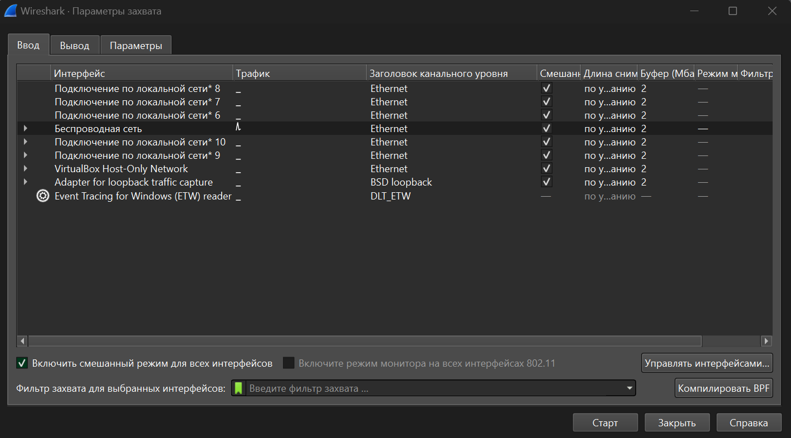{#fig:3 width=70%}

Шлюз по умолчанию для моего устройства - `192.168.1.1` (было определено в предыдущем задании). С помощью команды `ping 192.168.1.1` пингую шлюз по умолчанию (рис. [-@fig:4]). 

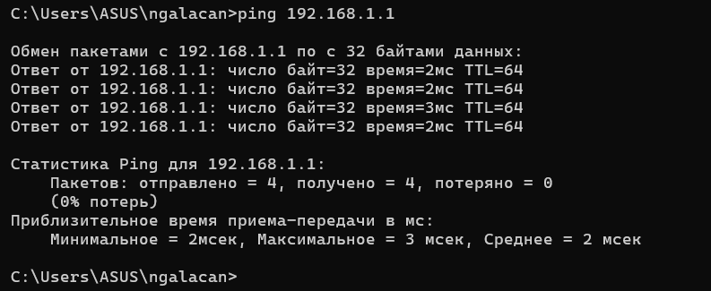{#fig:4 width=70%}

Останавливаю захват трафика. В строке фильтра указываю `arp or icmp`. Вижу 4 пакета-запроса и 4 пакета-ответа. Выбираю запрос и просматриваю в нижней части экрана информацию о нем. Длина кадра - 74 байта (592 бита)(рис. [-@fig:5]), относится к типу Ethernet II, MAC-адрес источника - адрес моего устройства, MAC-адрес получателя - `54:C2:50:7C:F5:F0`. Оба адреса индивидуальные и глобально администрируемые (последние биты в двоичном виде равны 0) (рис. [-@fig:6])

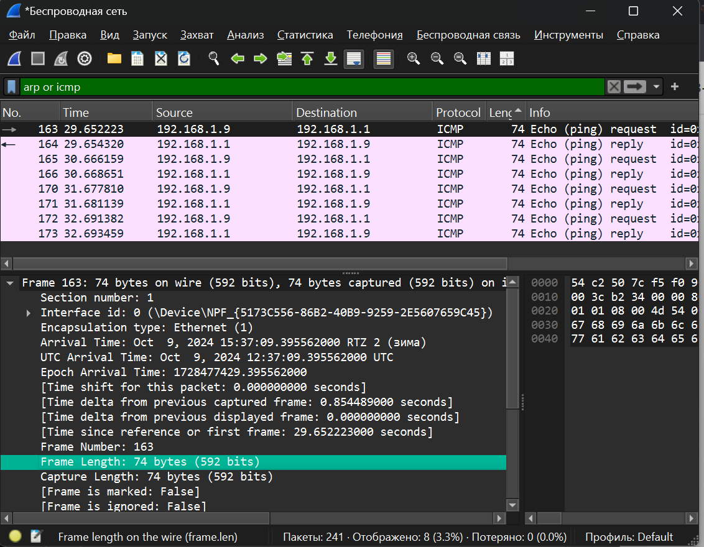{#fig:5 width=70%}

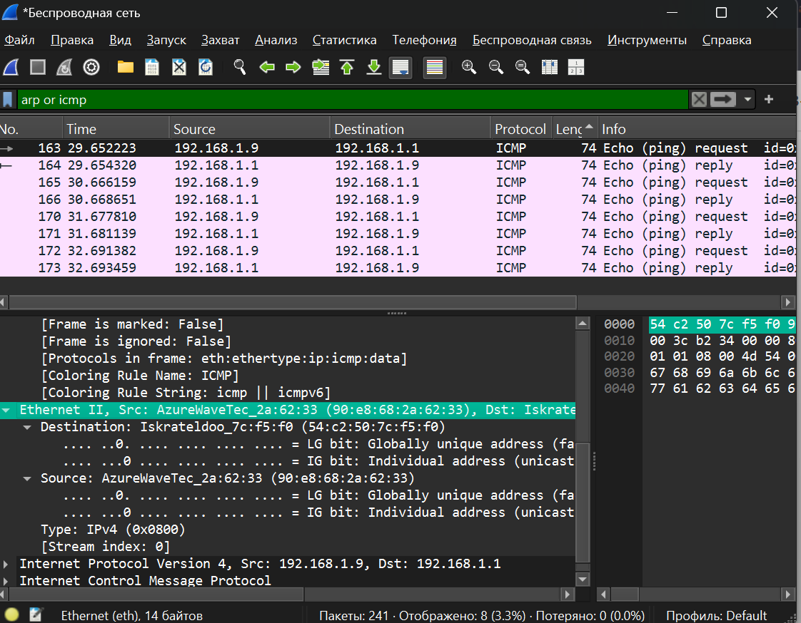{#fig:6 width=80%}

Выбираю эхо-ответ и просматриваю информацию. Длина кадра - 74 байта (592 бита) (рис. [-@fig:5]), относится к типу Ethernet II, MAC-адрес источника - `54:C2:50:7C:F5:F0`, MAC-адрес получателя - адрес моего устройства. Оба адреса индивидуальные и глобально администрируемые (последние биты в двоичном виде равны 0) (рис. [-@fig:7]). 

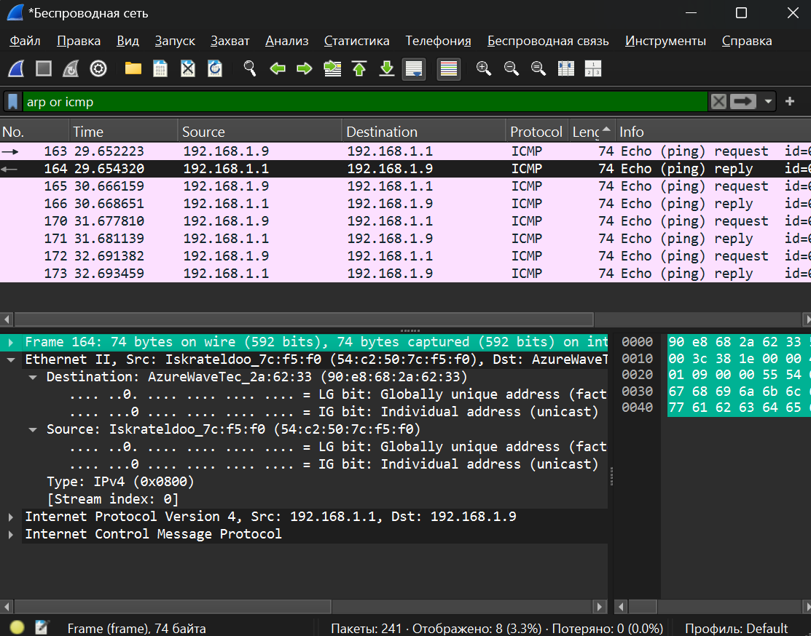{#fig:7 width=80%}

Нахожу кадры данных протокола ARP. Длина кадра равняется 42 байт, заголовок Ethernet занимает первые 14 байт
кадра, кадр относится к типу Ethernet II. MAC-адрес пункта назначения – это
первые 6 байт заголовка Ethernet, а MAC-адрес источника - следующие 6 байт
заголовка Ethernet, оба MAC-адреса являются индивидуальными и глобально администрируемыми. Также в заголовке Ethernet последние два байта обозначают вложенным пакет типа ARP (рис. [-@fig:8]).

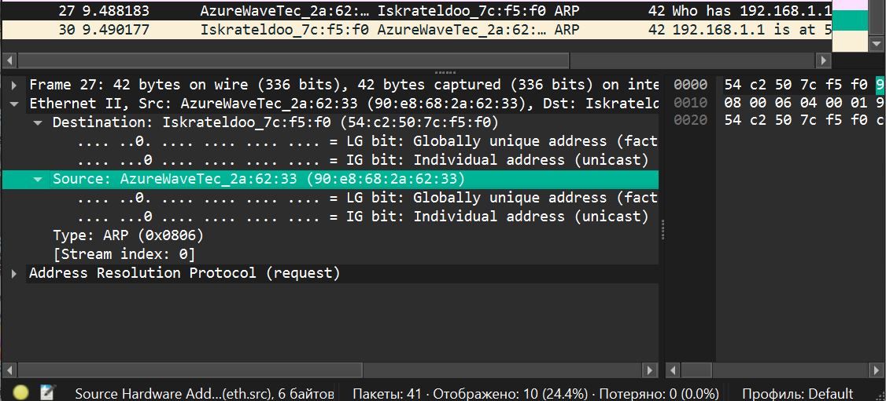{#fig:8 width=80%}

Снова начинаю захват трафика. Пингую адрес `vk.com`. Остановив захват трафика, просматриваю кадры. Длина кадра - 74 байта (592 бита). Для запроса источником является мой сетевой интерфейс, получателем - сам сайт, для ответа наоборот. MAC-адрес точки назначения – это первые 6 байт заголовка Ethernet, а
MAC-адрес источника – следующие 6 байт заголовка Ethernet, оба MAC-адреса
являются индивидуальными и глобально администрируемыми (рис. [-@fig:9], рис. [-@fig:10]).

{#fig:9 width=70%}

{#fig:10 width=70%}

Изучаю запросы и ответы ARP. MAC-адрес точки назначения – это первые 6 байт заголовка Ethernet, а
MAC-адрес источника – следующие 6 байт заголовка Ethernet, оба MAC-адреса
являются индивидуальными и глобально администрируемыми (рис. [-@fig:11]).

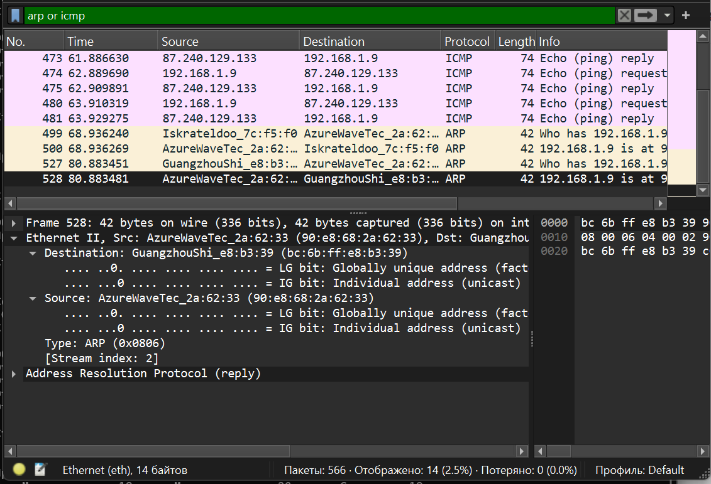{#fig:11 width=70%}

## Анализ протоколов транспортного уровня в Wireshark

Запустив Wireshark, начинаю захват трафика. Открываю в браузере сайт, работающий по протоколу
HTTP (http://info.cern.ch/). Перемещаюсь по страницам. В строке фильтра указываю `http` и просматриваю информацию по протоколу TCP о запросе. Порт источника задан случайно и равен 51310, порт назначения равен 80 - это стандартный порт HTTP (рис. [-@fig:12])

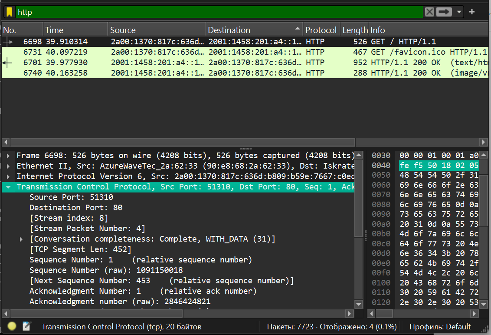{#fig:12 width=70%}

В случае ответа порты заданы наоборот, то есть источник - 80 порт, назначение - 51310 (рис. [-@fig:13])

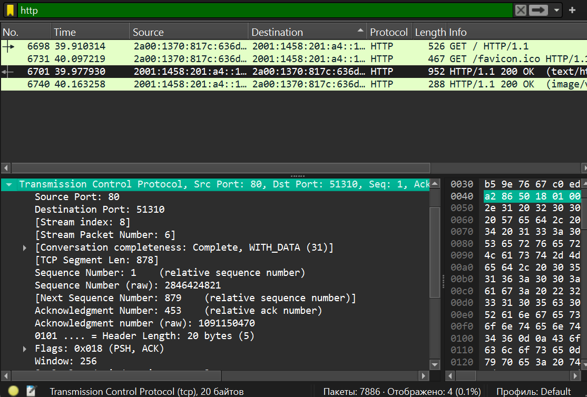{#fig:13 width=70%}

В Wireshark в строке фильтра ввожу `dns` и просматриваю информацию по
протоколу UDP в случае запроса. Порт источника задан случайно и равен 58049,
порт назначения равен 53 (порт DNS по умолчанию) (рис. [-@fig:14]). В случае ответа порты заданы наоборот рис. ([-@fig:15]).

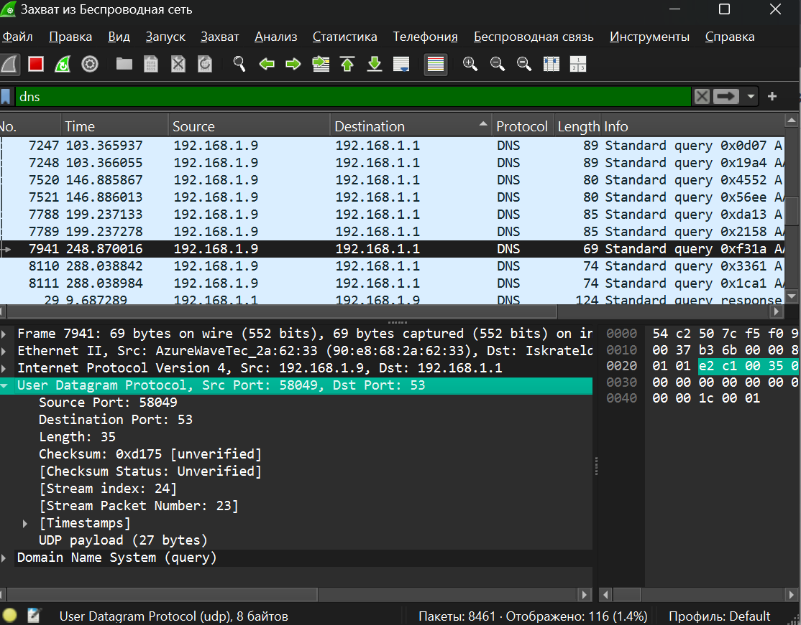{#fig:14 width=70%}

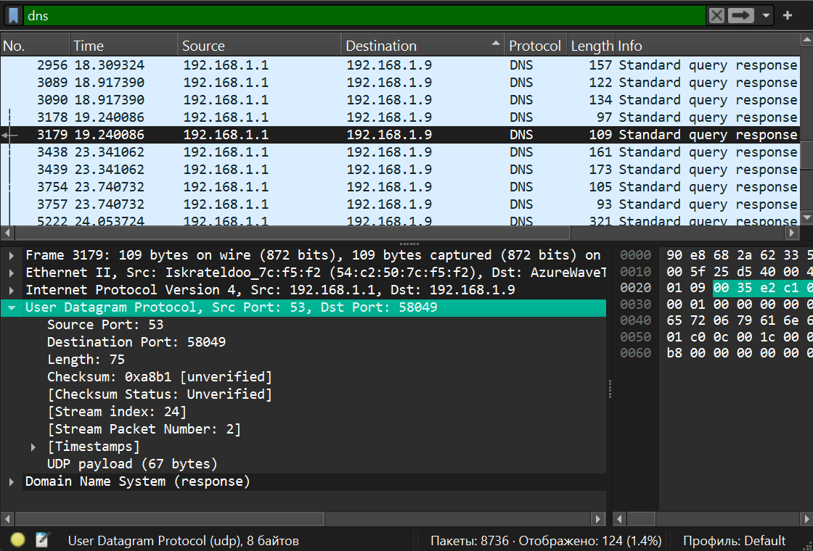{#fig:15 width=70%}

В строке фильтра указываю `quic`.  Порт источника задан случайно, 
порт назначения равен 443 - это стандартный порт HTTPS, следовательно, `quic` сразу шифруется. В случае ответа порты заданы наоборот (рис. [-@fig:16]).

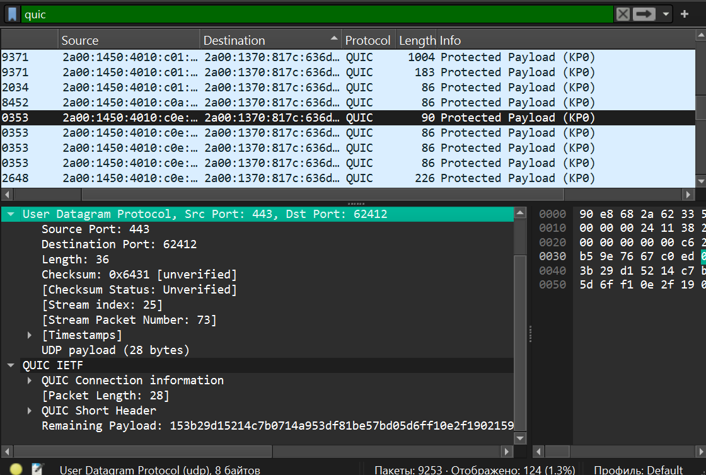{#fig:16 width=70%}

## Анализ handshake протокола TCP в Wireshark

Начав захват трафика, запускаю в браузере сайт, работающий по протоколу
HTTP (http://info.cern.ch/). Установление связи клиент-сервер
в TCP осуществляется в три этапа (трёхступенчатый handshake).

1. Режим активного доступа (Active Open). Клиент посылает сообщение SYN, ISSa, т.е. в передаваемом сообщении установлен бит SYN (Synchronize Sequence Number), а в поле Порядковый номер (Sequence Number) — начальное 32-битное значение ISSa (Initial Sequence Number)

Нахожу кадр с флагом SYN. Sequence Number = 0 (рис. [-@fig:17]).

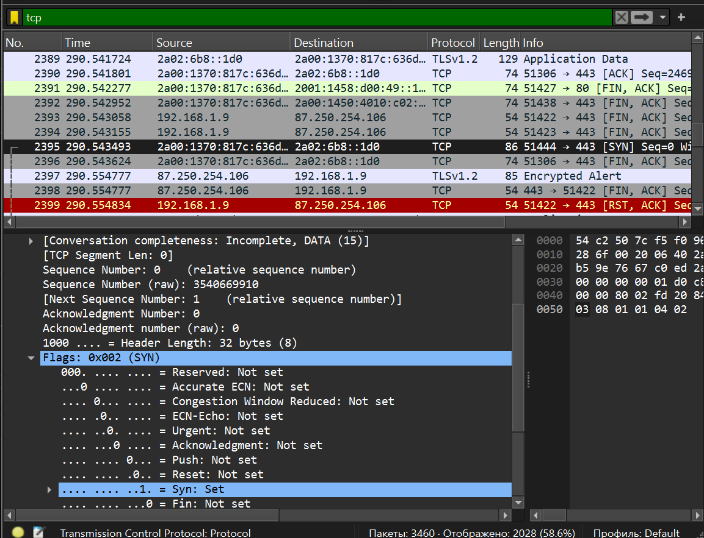{#fig:17 width=70%}

2. Режим пассивного доступа (Passive Open). Сервер откликается, посылая сообщение SYN, ACK, ISSb, ACK(ISSa+1), т.е. установлены биты SYN и ACK; в поле Порядковый номер (Sequence Number) хостом B устанавливается начальное значение счётчика — ISSb; поле Номер подтверждения (Acknowledgment Number)
содержит значение ISSa, полученное в первом пакете от хоста A и увеличенное на единицу. 

Кадр с флагами SYN и ACK, где ACK равен Sequence Number из предыдущего шага, увеличенный на 1 (0 + 1 = 1) (рис. [-@fig:18]).

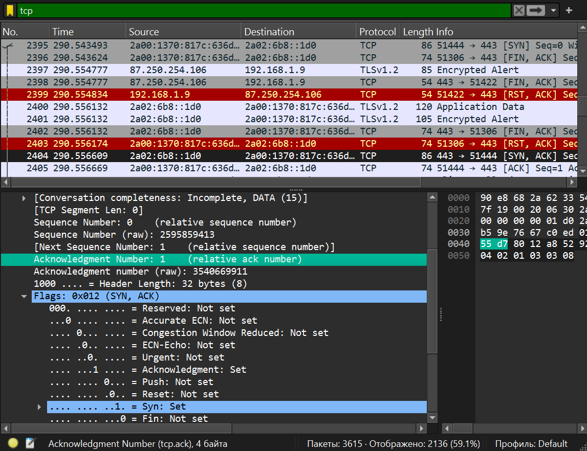{#fig:18 width=70%}

3. Завершение рукопожатия. Клиент отправляет подтверждение получения SYNсегмента от сервера с идентификатором, равным ISN (сервера)+1: ACK, ISSa+1, ACK(ISSb+1). В этом пакете установлен бит ACK, поле Порядковый номер (Sequence Number) содержит ISSa+1, поле Номер подтверждения (Acknowledgment Number)
содержит значение ISSb+1. Посылкой этого пакета заканчивается трёхступенчатый handshake, и TCP-соединение считается установленным. 

Теперь клиент может посылать пакеты с данными на сервер по только что
созданному виртуальному TCP-каналу: ACK, ISSa+1, ACK(ISSb+1); DATA.

Кадр с флагом ACK, где Sequence Number равен 1, Acknowledgment Number равен 1 (рис. [-@fig:19]).

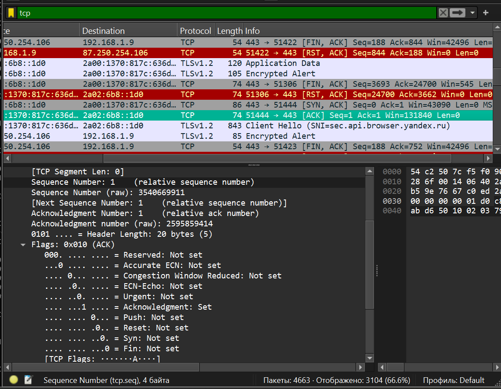{#fig:19 width=70%}

В Wireshark в меню «Статистика» выбираю «График Потока». 
На графике видно, что сначала клиент послал сообщение на сервер, значение Seq = 0. Затем сервер откликнулся, значение Seq = 0, а значение Sck = 1. И в третьем пакете клиент оправил подтверждение
получение SYN-сегмента, оба значения Syn и Ack равны 1 (рис. [-@fig:20]).

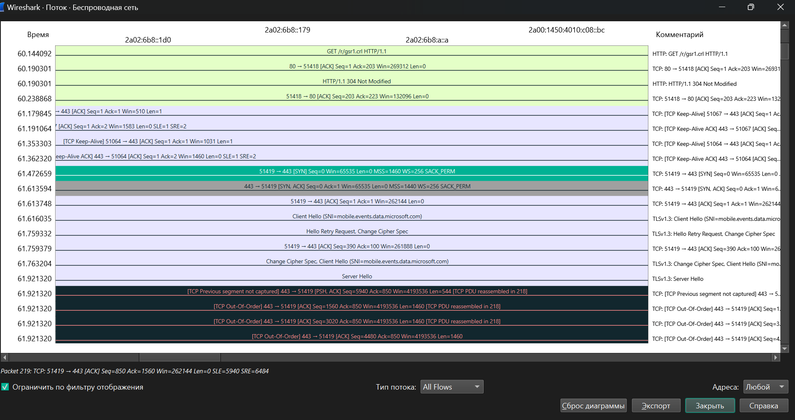{#fig:20 width=70%}

В Wireshark останавливаю захват трафика. 

# Выводы

В результате выполнения работы были изучены посредством Wireshark кадры Ethernet, произведен анализ PDU протоколов транспортного и прикладного уровней стека TCP/IP.

