---
## Front matter
lang: ru-RU
title: Презентация по лабораторной работе №4
subtitle: "Подготовка экспериментального стенда GNS3"
author:
  - Галацан Николай
institute:
  - Российский университет дружбы народов, Москва, Россия

## i18n babel
babel-lang: russian
babel-otherlangs: english

## Formatting pdf
toc: false
toc-title: Содержание
slide_level: 2
aspectratio: 169
section-titles: true
theme: metropolis
header-includes:
 - \metroset{progressbar=frametitle,sectionpage=progressbar,numbering=fraction}
 - '\makeatletter'
 - '\beamer@ignorenonframefalse'
 - '\makeatother'
---


## Докладчик

  * Галацан Николай
  * 1032225763
  * уч. группа: НПИбд-01-22
  * Факультет физико-математических и естественных наук
  * Российский университет дружбы народов

## Цели и задачи

Установка и настройка GNS3 и сопутствующего программного обеспечения.

# Установка GNS3-all-in-one


## Выполнение лабораторной работы


{#fig:1 width=60%}

## Выполнение лабораторной работы

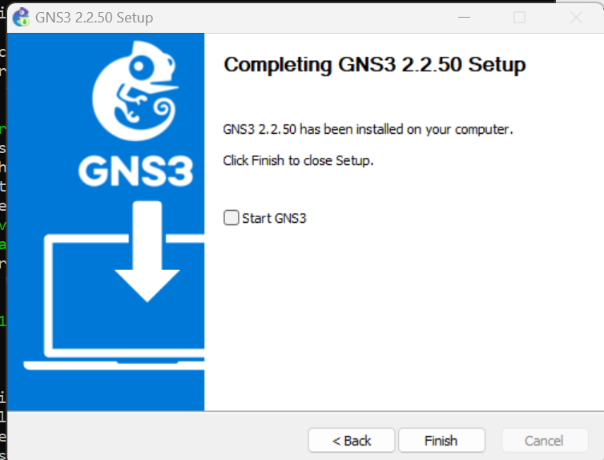{#fig:2 width=60%}


#  Установка GNS3 VM для VirtualBox

## Выполнение лабораторной работы

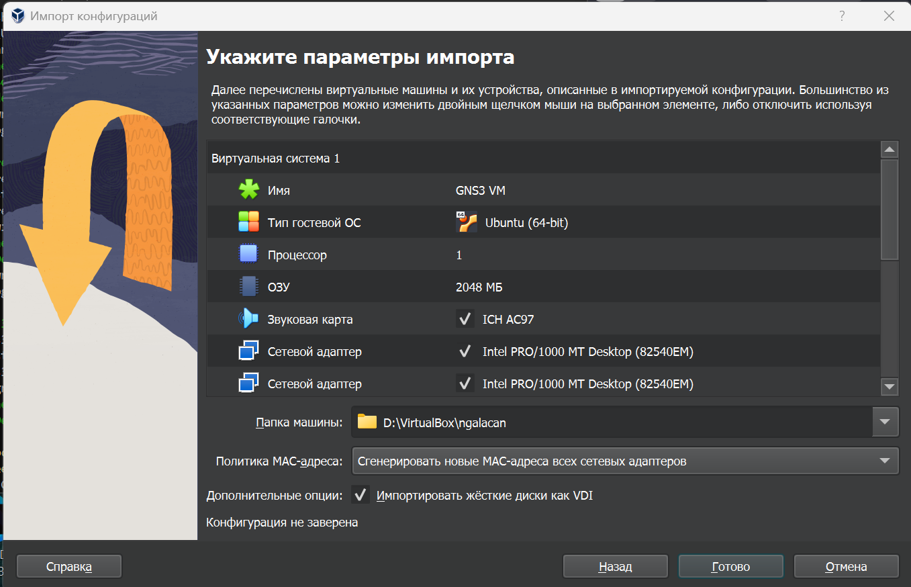{#fig:3 width=70%}

## Выполнение лабораторной работы 

```
vboxmanage modifyvm "GNS3 VM" --nested-hw-virt on
```

## Выполнение лабораторной работы

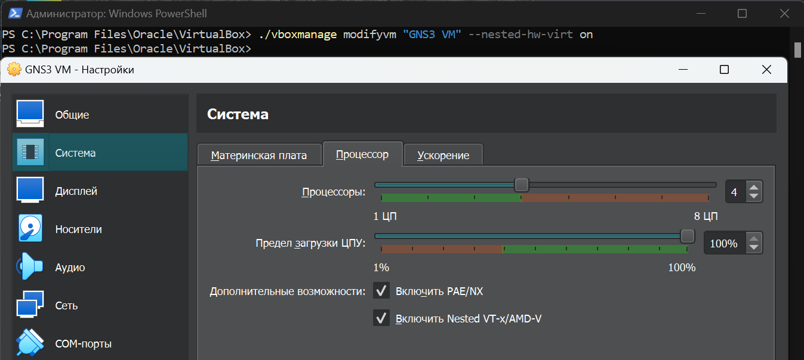{#fig:4 width=70%}

## Выполнение лабораторной работы


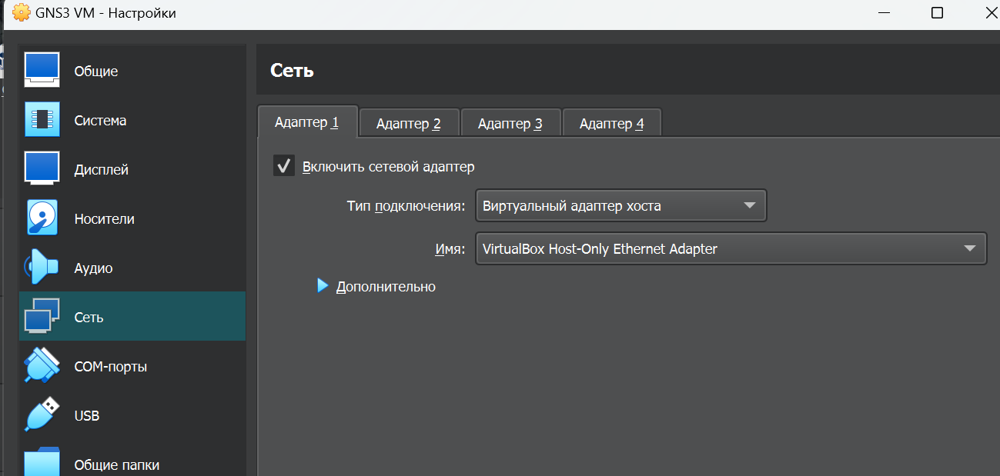{#fig:5 width=60%}

# Запуск экземпляра GNS3 в VirtualBox

## Выполнение лабораторной работы

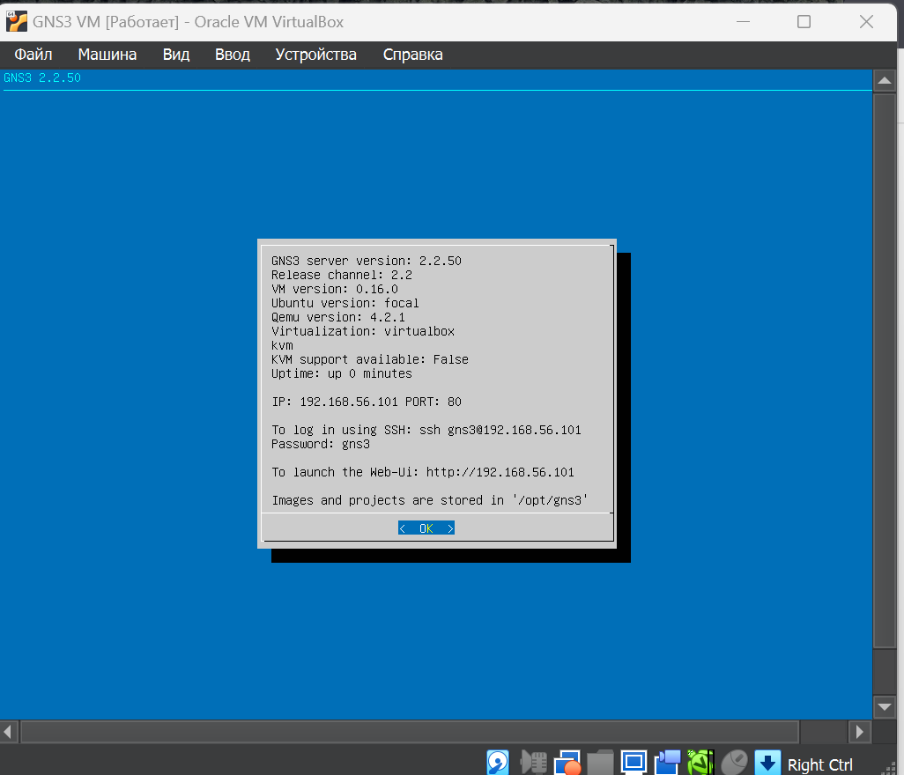{#fig:6 width=50%}

## Выполнение лабораторной работы

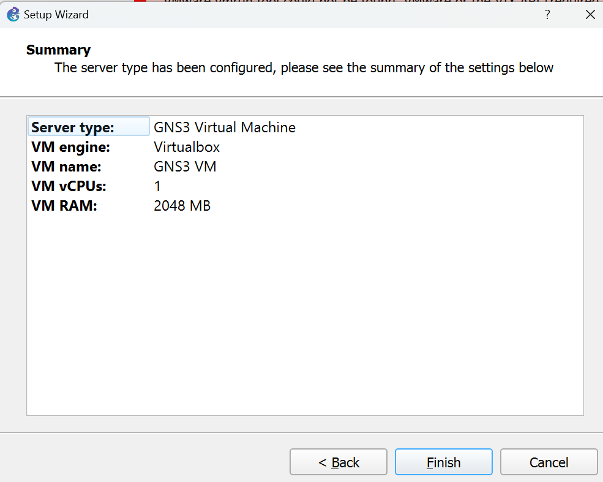{#fig:7 width=60%}

## Выполнение лабораторной работы

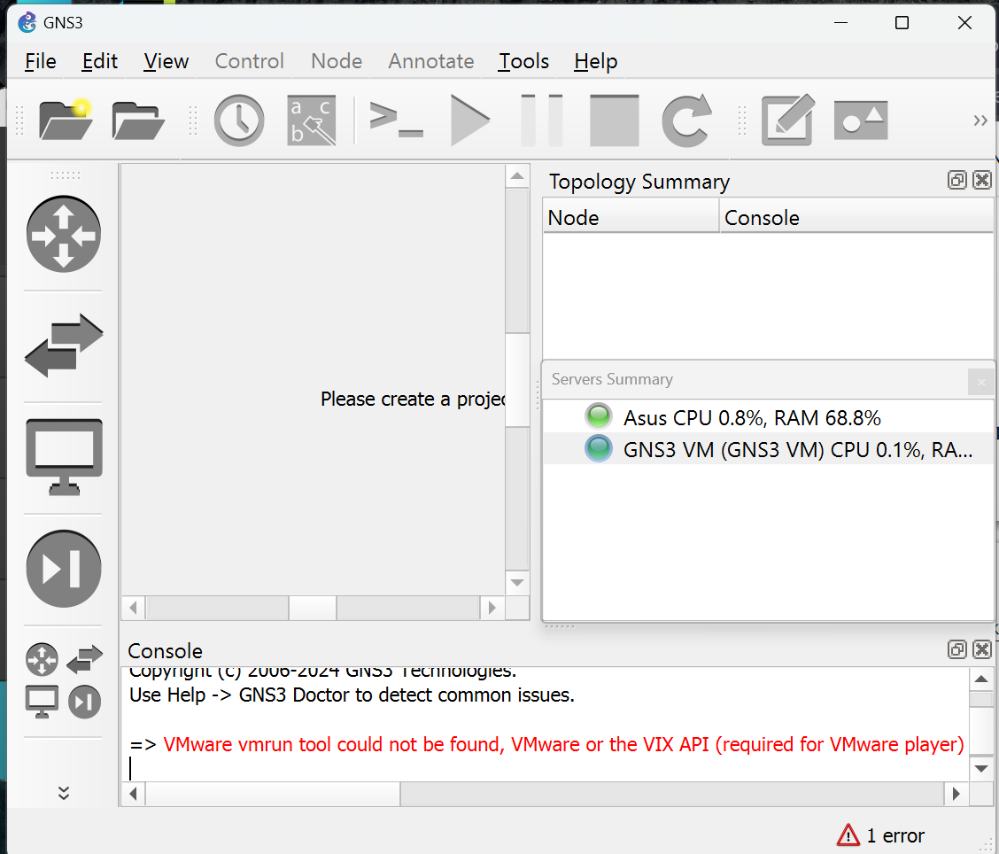{#fig:8 width=50%}

#  Добавление образа маршрутизатора FRR

## Выполнение лабораторной работы

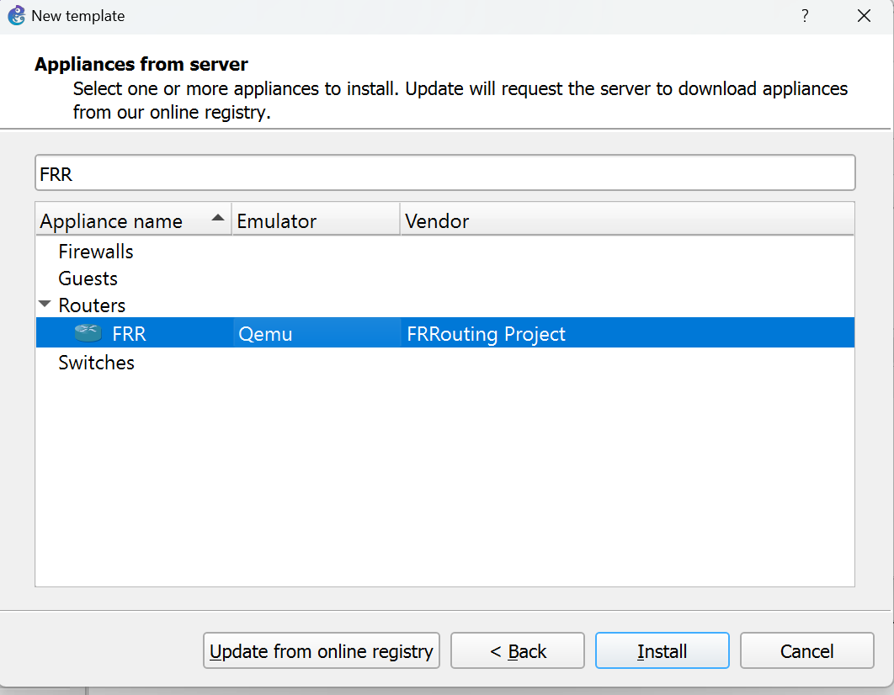{#fig:9 width=60%}

## Выполнение лабораторной работы

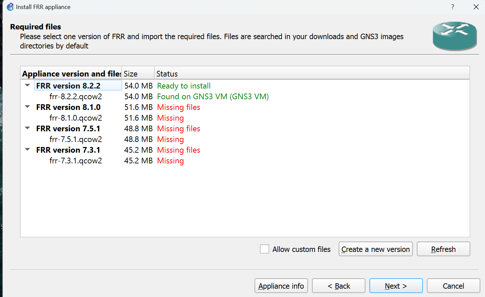{#fig:10 width=60%}

## Выполнение лабораторной работы

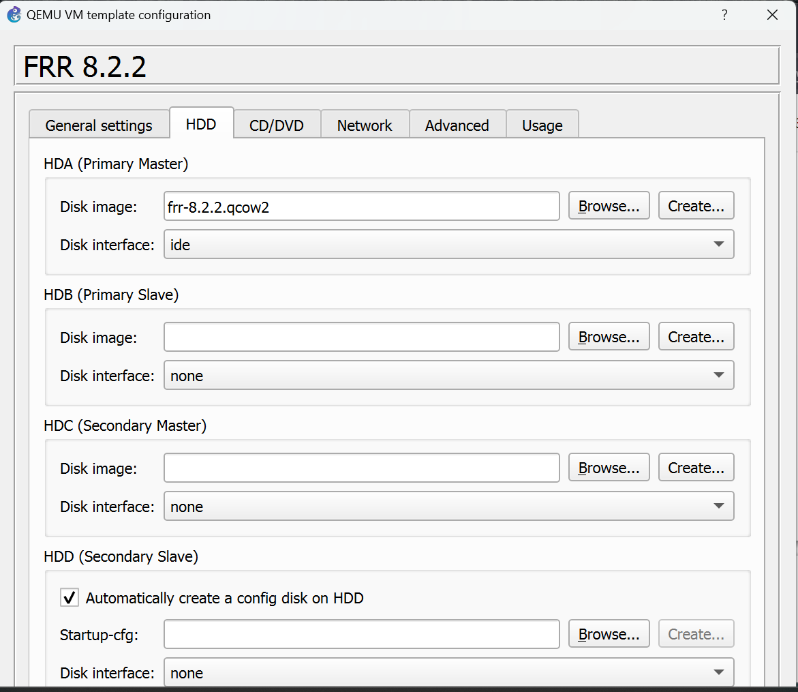{#fig:11 width=40%}

# Добавление образа маршрутизатора VyOS

## Выполнение лабораторной работы

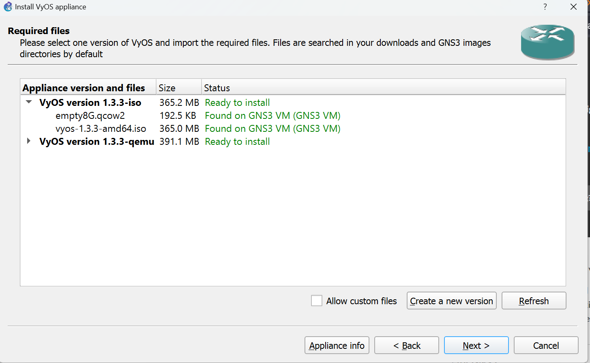{#fig:12 width=60%}

## Выполнение лабораторной работы

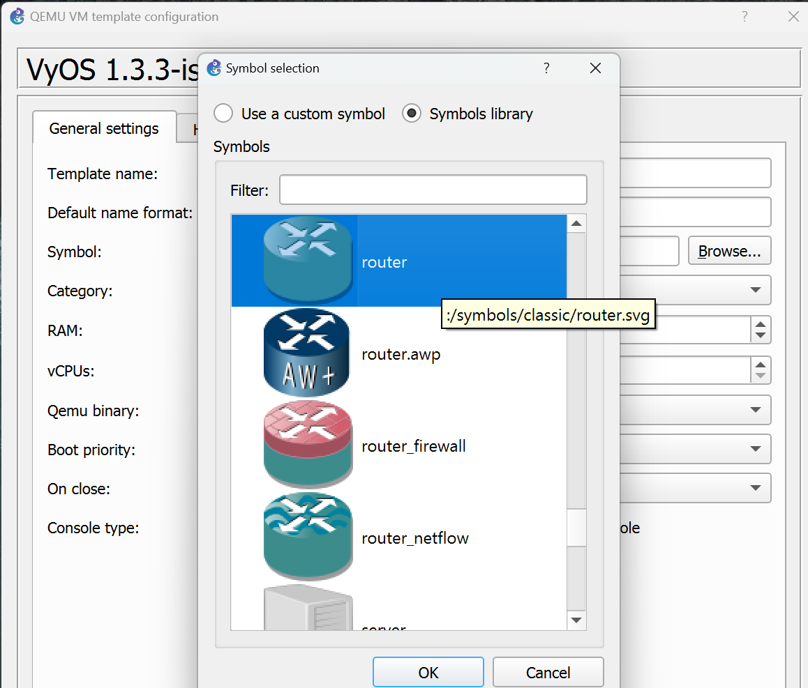{#fig:14 width=50%}

## Выполнение лабораторной работы

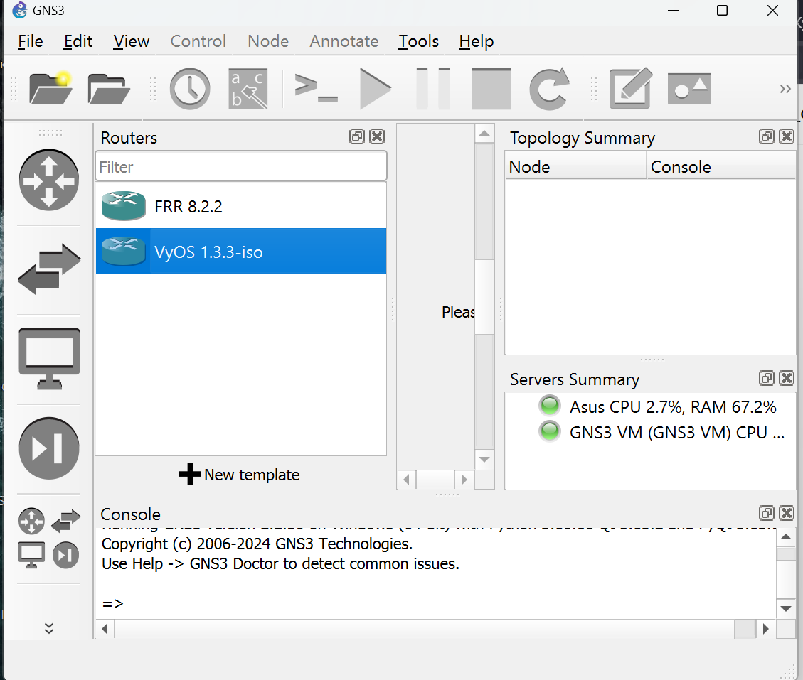{#fig:15 width=50%}


## Выводы

В результате выполнения работы была произведена установка и настройка GNS3 и сопутствующего программного обеспечения.


