---
## Front matter
title: "Отчет по лабораторной работе №4"
subtitle: "Подготовка экспериментального стенда GNS3"
author: "Галацан Николай, НПИбд-01-22"

## Generic otions
lang: ru-RU
toc-title: "Содержание"

## Bibliography
bibliography: bib/cite.bib
csl: pandoc/csl/gost-r-7-0-5-2008-numeric.csl

## Pdf output format
toc: true # Table of contents
toc-depth: 2
lof: true # List of figures
lot: false # List of tables
fontsize: 12pt
linestretch: 1.5
papersize: a4
documentclass: scrreprt
## I18n polyglossia
polyglossia-lang:
  name: russian
  options:
	- spelling=modern
	- babelshorthands=true
polyglossia-otherlangs:
  name: english
## I18n babel
babel-lang: russian
babel-otherlangs: english
## Fonts
mainfont: IBM Plex Serif
romanfont: IBM Plex Serif
sansfont: IBM Plex Sans
monofont: IBM Plex Mono
mathfont: STIX Two Math
mainfontoptions: Ligatures=Common,Ligatures=TeX,Scale=0.94
romanfontoptions: Ligatures=Common,Ligatures=TeX,Scale=0.94
sansfontoptions: Ligatures=Common,Ligatures=TeX,Scale=MatchLowercase,Scale=0.94
monofontoptions: Scale=MatchLowercase,Scale=0.94,FakeStretch=0.9
mathfontoptions:
## Biblatex
biblatex: true
biblio-style: "gost-numeric"
biblatexoptions:
  - parentracker=true
  - backend=biber
  - hyperref=auto
  - language=auto
  - autolang=other*
  - citestyle=gost-numeric
## Pandoc-crossref LaTeX customization
figureTitle: "Рис."
tableTitle: "Таблица"
listingTitle: "Листинг"
lofTitle: "Список иллюстраций"
lotTitle: "Список таблиц"
lolTitle: "Листинги"
## Misc options
indent: true
header-includes:
  - \usepackage{indentfirst}
  - \usepackage{float} # keep figures where there are in the text
  - \floatplacement{figure}{H} # keep figures where there are in the text
---

# Цель работы

Установка и настройка GNS3 и сопутствующего программного обеспечения.


# Задание

1. Установить GNS3-all-in-one, GNS3 VM, проверить корректность запуска.

2. Импортировать в GNS3 образ маршрутизатора FRR.

3. Импортировать в GNS3 образ маршрутизатора VyOS.


# Выполнение лабораторной работы

## Установка GNS3

### Установка GNS3-all-in-one

Устанавливаю GNS3 с помощью менеджера пакетов Chocolatey. После запуска графического окна по установке следую указаниям, нажимая **Next**, принимая соглашение по лицензии, выбирая отображение названия
каталога в стартовом меню.
В процессе установки при выборе комплектации отмечаю MSVC Runtime (отмечено по умолчанию), GNS3-Desktop, GNS3-VM, Tools (рис. [-@fig:1]).

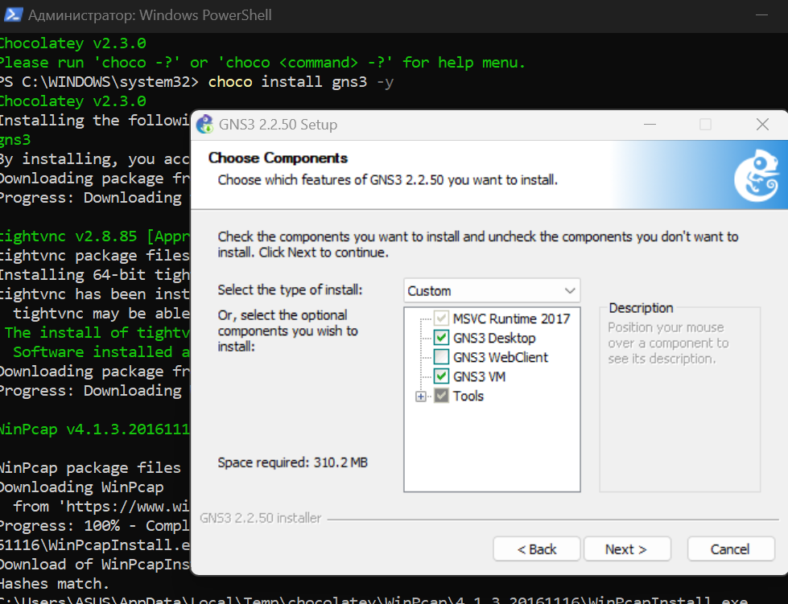{#fig:1 width=70%}

Далее следую инструкциям установщика, нажимая **Next**. Дожидаюсь установки GNS3 и пакетов, принимаю соглашение по лицензии и завершаю установку  (рис. [-@fig:2]).

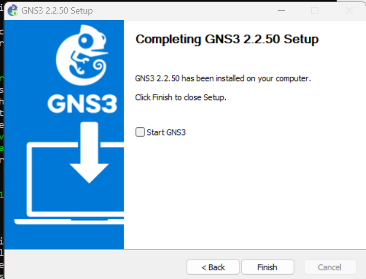{#fig:2 width=70%}


###  Установка GNS3 VM для VirtualBox

Скачиваю архив с образом виртуальной машины GNS3 VM с официального сайта, распаковываю его. Запустив VirtualBox, выбираю *Файл* -> *Импорт конфигураций*. Указываю месторасположение распакованного образа `GNS3 VM.ova`. В  следующем окне в параметрах импорта выбираю в политике MAC-адреса 
«Сгенерировать новые MAC-адреса всех сетевых адаптеров» и дожидаюсь конца импорта (рис. [-@fig:3]). 

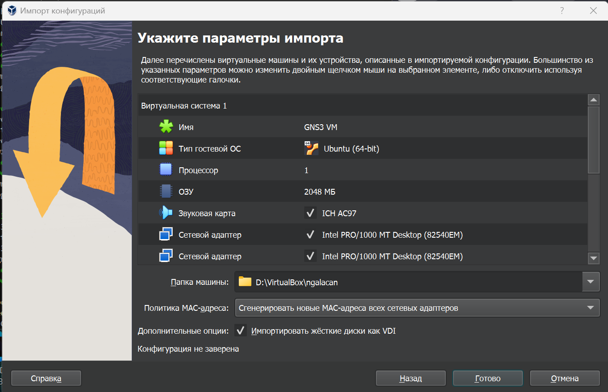{#fig:3 width=70%}

Перехожу к настройке ВМ. Для этого в VirtualBox выбираю импортированную виртуальную машину и перехожу в меню *Машина* -> *Настроить*. Следую рекомендациям из сообщения о обнаружении неправильных настроек и исправляю ошибки. Проверяю минимальные ресурсы (2048 МБ основной памяти, 2 процессора). Настраиваю вложенную виртуализацию в опции *Система*, вкладка *Процессор*. В графическом интерфейсе нет возможности отметить флажок *Включить Nested VT-x/AMD-V*. Для включения использую команду 

```
vboxmanage modifyvm "GNS3 VM" --nested-hw-virt on
```
и проверяю, что галочка появилась (рис. [-@fig:4]). 

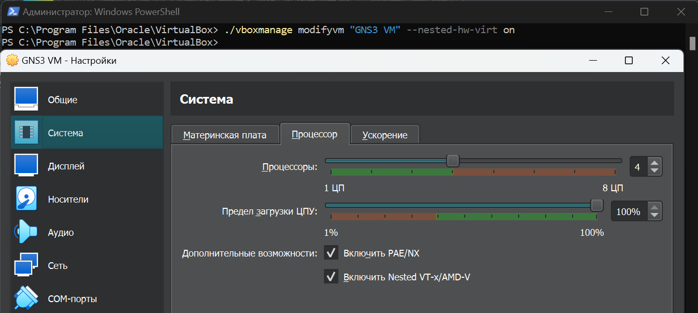{#fig:4 width=70%}


Настраиваю сетевой адаптер, убедившись, что выбран режим *Виртуальный адаптер хоста* (рис. [-@fig:5]).


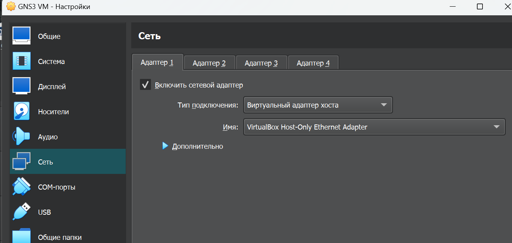{#fig:5 width=70%}

### Запуск экземпляра GNS3 в VirtualBox

Запускаю виртуальную машину GNS3 VM (рис. [-@fig:6]).

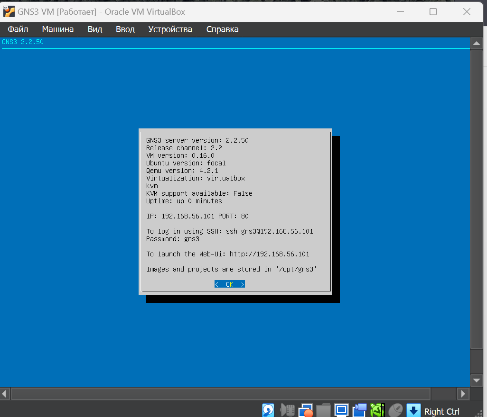{#fig:6 width=80%}

Запускаю приложение GNS3 и в мастере настройки выбираю способ работы, настройки локального сервера. Выбираю IP-адрес привязки хоста. После успешного подсоединения появляется окно с итоговыми настройками (рис. [-@fig:7]). 

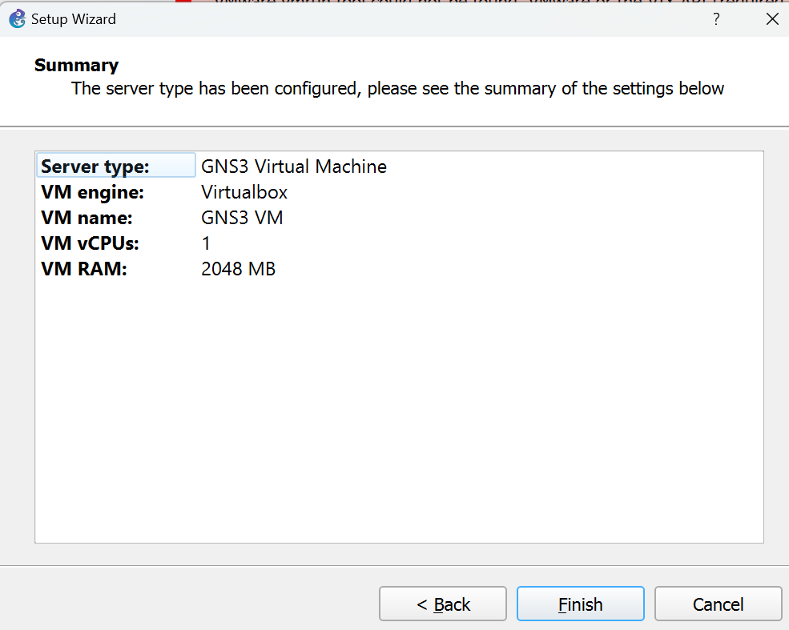{#fig:7 width=80%}

В списке серверов вижу GNS3 VM  (рис. [-@fig:8]).

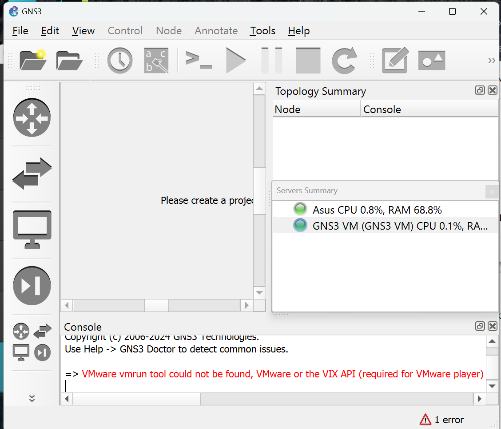{#fig:8 width=80%}

Для выключения GNS3 использую *File* -> *Quit*. Выключается также виртуальная машина.


## Подключение образа оборудования в GNS3

###  Добавление образа маршрутизатора FRR

 В рабочем пространстве GNS3 на левой боковой панели выбираю просмотр 
маршрутизаторов, затем нажимаю *+ New template*.  В открывшемся окне указываю установку образа с GNS3-сервера, нажимаю  *Next*, оставляю эмулятор по умолчанию. Далее в списке роутеров выбираю FRR (рис. [-@fig:9]) и нажимаю *Install*. Скачиваю и импортирую необходимые файлы, завершаю установку (рис. [-@fig:10]).

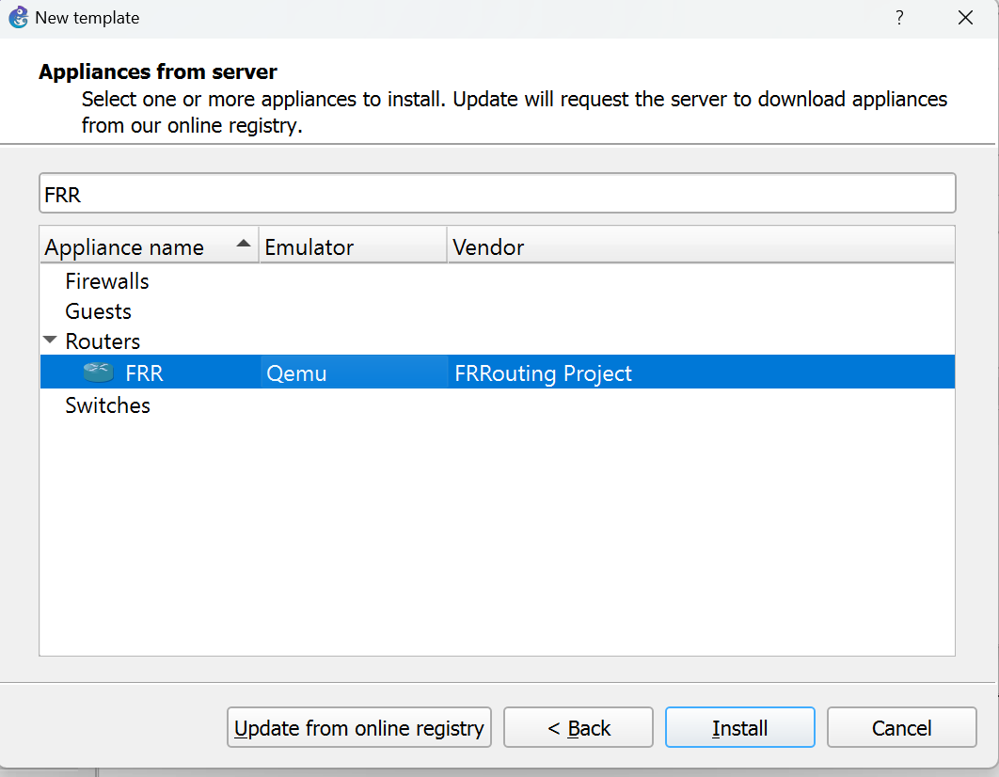{#fig:9 width=70%}

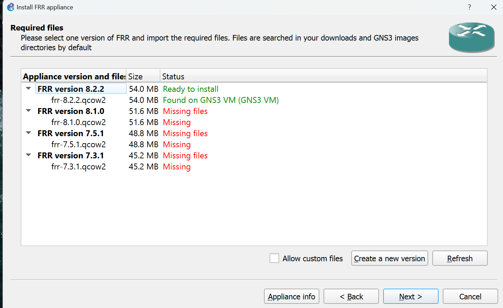{#fig:10 width=70%}

Для настройки образа щелкаю правой кнопкой на образе и выбираю *Configure template*. В открывшемся окне во вкладке *General settings* в поле *On close* выбираю *Send the shutdown signal (ACPI)*. Во вкладке *HDD* ставлю галочку *Automatically create a config disk on HDD* (рис. [-@fig:11]).

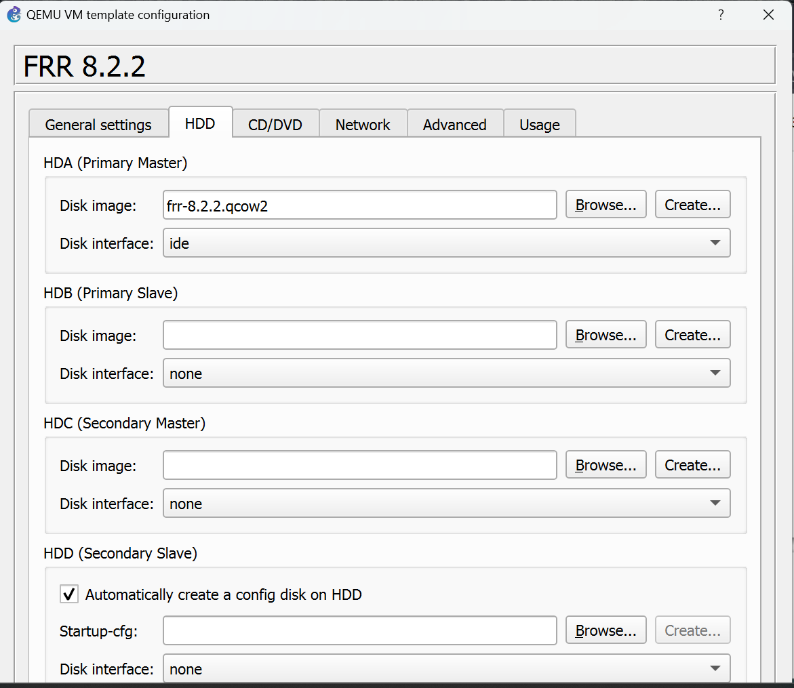{#fig:11 width=70%}

### Добавление образа маршрутизатора VyOS

Скачав установочный файл VyOS, перехожу в *File* -> *Import appliance* и импортирую его. Далее произвожу аналогичные настройке FRR шаги, скачиваю необходимые файлы и импортирую их, завершаю установку  (рис. [-@fig:12])

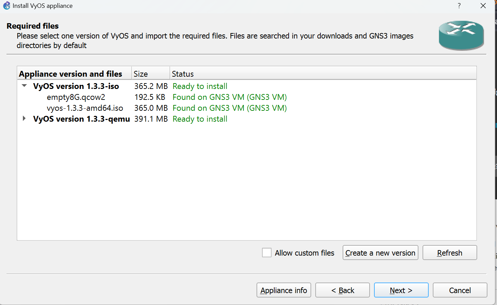{#fig:12 width=70%}

Для настройки образа маршрутизатора VyOS щелкаю правой кнопкой на образе и выбираю *Configure template*. В открывшемся окне во вкладке *General settings* в поле *On close* выбираю *Send the shutdown signal (ACPI)*. Во вкладке *HDD* ставлю галочку *Automatically create a config disk on HDD*. Также изменяю отображаемый символ устройства, перейдя в *General settings* -> *Symbol* (рис. [-@fig:13]). В рабочем пространстве GNS3 теперь отображаются два разных образа маршрутизаторов рис. ([-@fig:14]).

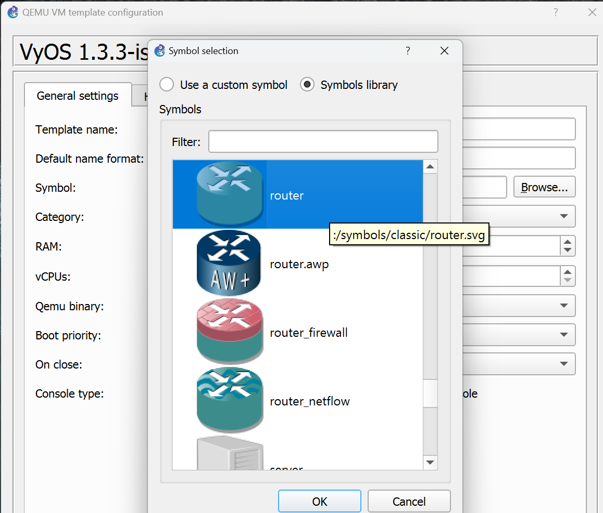{#fig:13 width=70%}

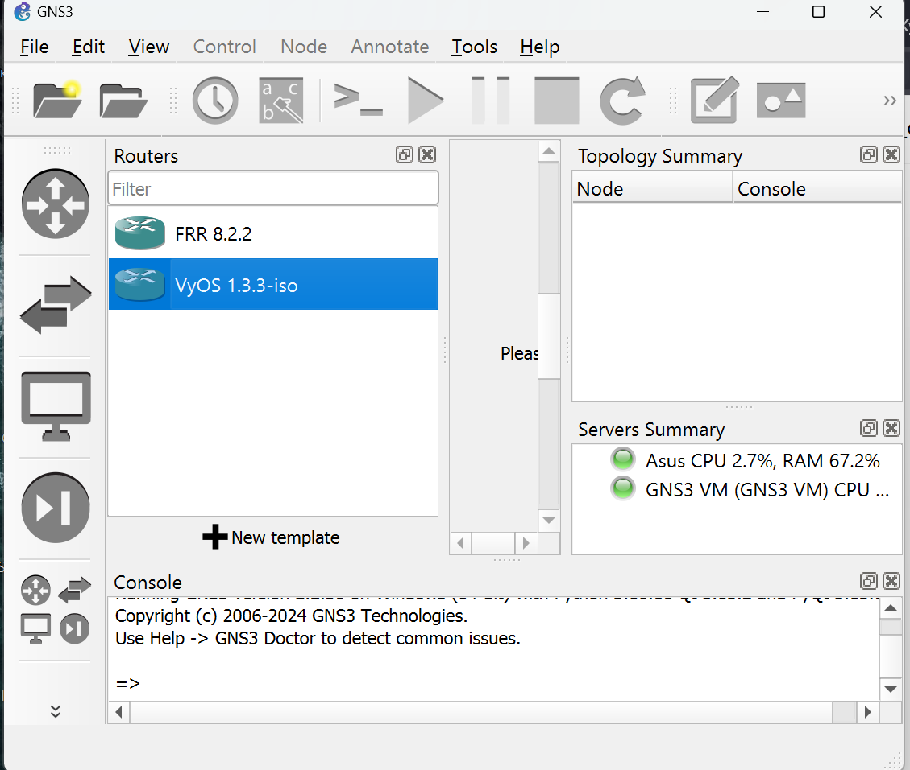{#fig:14 width=70%}


# Выводы

В результате выполнения работы была произведена установка и настройка GNS3 и сопутствующего программного обеспечения.


