---
## Front matter
title: "Отчет по лабораторной работе №5"
subtitle: "Простые сети в GNS3. Анализ трафика"
author: "Галацан Николай, НПИбд-01-22"

## Generic otions
lang: ru-RU
toc-title: "Содержание"

## Bibliography
bibliography: bib/cite.bib
csl: pandoc/csl/gost-r-7-0-5-2008-numeric.csl

## Pdf output format
toc: true # Table of contents
toc-depth: 2
lof: true # List of figures
lot: false # List of tables
fontsize: 12pt
linestretch: 1.5
papersize: a4
documentclass: scrreprt
## I18n polyglossia
polyglossia-lang:
  name: russian
  options:
	- spelling=modern
	- babelshorthands=true
polyglossia-otherlangs:
  name: english
## I18n babel
babel-lang: russian
babel-otherlangs: english
## Fonts
mainfont: IBM Plex Serif
romanfont: IBM Plex Serif
sansfont: IBM Plex Sans
monofont: IBM Plex Mono
mathfont: STIX Two Math
mainfontoptions: Ligatures=Common,Ligatures=TeX,Scale=0.94
romanfontoptions: Ligatures=Common,Ligatures=TeX,Scale=0.94
sansfontoptions: Ligatures=Common,Ligatures=TeX,Scale=MatchLowercase,Scale=0.94
monofontoptions: Scale=MatchLowercase,Scale=0.94,FakeStretch=0.9
mathfontoptions:
## Biblatex
biblatex: true
biblio-style: "gost-numeric"
biblatexoptions:
  - parentracker=true
  - backend=biber
  - hyperref=auto
  - language=auto
  - autolang=other*
  - citestyle=gost-numeric
## Pandoc-crossref LaTeX customization
figureTitle: "Рис."
tableTitle: "Таблица"
listingTitle: "Листинг"
lofTitle: "Список иллюстраций"
lotTitle: "Список таблиц"
lolTitle: "Листинги"
## Misc options
indent: true
header-includes:
  - \usepackage{indentfirst}
  - \usepackage{float} # keep figures where there are in the text
  - \floatplacement{figure}{H} # keep figures where there are in the text
---

# Цель работы

Построение простейших моделей сети на базе коммутатора и маршрутизаторов FRR и VyOS в GNS3, анализ трафика посредством Wireshark.

# Выполнение лабораторной работы

##  Моделирование простейшей сети на базе коммутатора в GNS3

**Постановка задачи**

1. Построить в GNS3 топологию сети, состоящей из коммутатора Ethernet и двух
оконечных устройств (персональных компьютеров).
2. Задать оконечным устройствам IP-адреса в сети 192.168.1.0/24. Проверить
связь.

Запускаю GNS3 VM и GNS3. Создаю новый проект. В рабочей области GNS3 размещаю коммутатор Ethernet и два VPCS. Щёлкнув на устройстве правой кнопкой мыши в меню *Configure* изменяю название устройств. Затем соединяю VPCS с коммутатором и отображаю обозначение интерфейсов соединения (рис. [-@fig:1]).

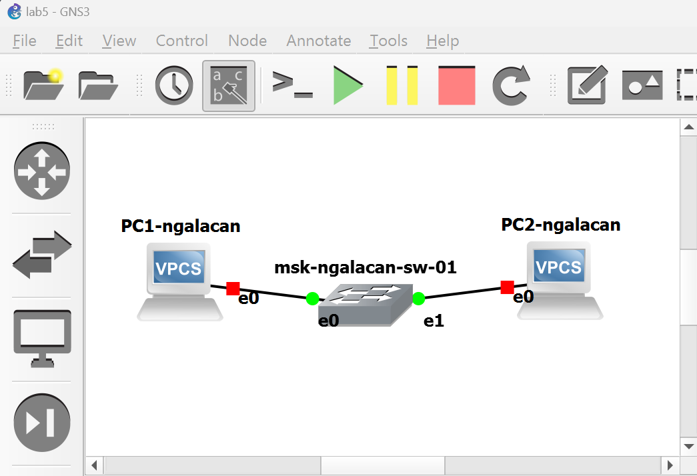{#fig:1 width=70%}

Задаю IP-адреса VPCS. Для этого с помощью меню, вызываемого правой кнопкой мыши, запускаю PC-1, затем вызываю его терминал. Для просмотра синтаксиса возможных для ввода команд ввожу /?. Для задания IP-адреса `192.168.1.11` в сети `192.168.1.0/24` ввожу команду `ip 192.168.1.11/24 192.168.1.1`, для сохранения - `save` (рис. [-@fig:2]). Аналогичным образом задаю адрес `192.168.1.12` на PC-2.

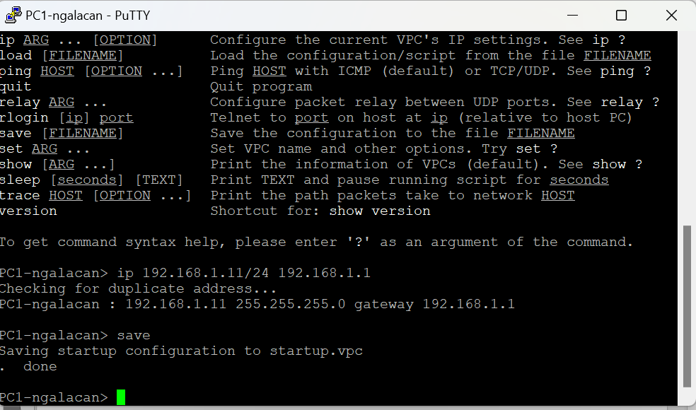{#fig:2 width=70%}

Проверяю работоспособность сети с помощью команды `ping 192.168.1.11` на PC-2 (рис. [-@fig:3]). Останавливаю все узлы в проекте.

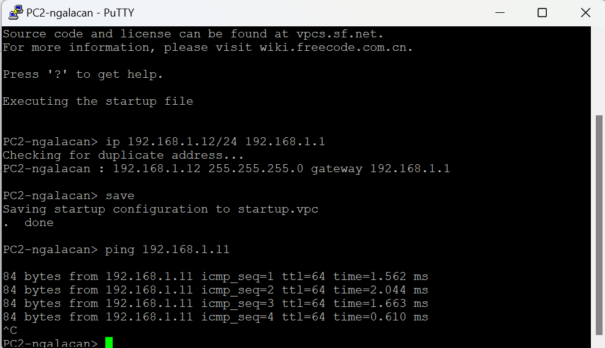{#fig:3 width=70%}

## Анализ трафика в GNS3 посредством Wireshark

**Постановка задачи**

1. С помощью Wireshark захватить и проанализировать ARP-сообщения.
2. С помощью Wireshark захватить и проанализировать ICMP-сообщения

Запускаю на соединении между PC-1 и коммутатором анализатор трафика. Для этого щёлкаю правой кнопкой мыши на соединении, выбираю *Start capture*. Запускается Wireshark. В проекте стартую все узлы, в окне Wireshark отображается информация по протоколу ARP. В поле кадра физического уровня можно узнать длину кадра. В поле канального уровня можно посмотреть MAC-адреса источника и получателя.  По нулевому и первому битам можно определить тип MAC-адресов (рис. [-@fig:4]). 

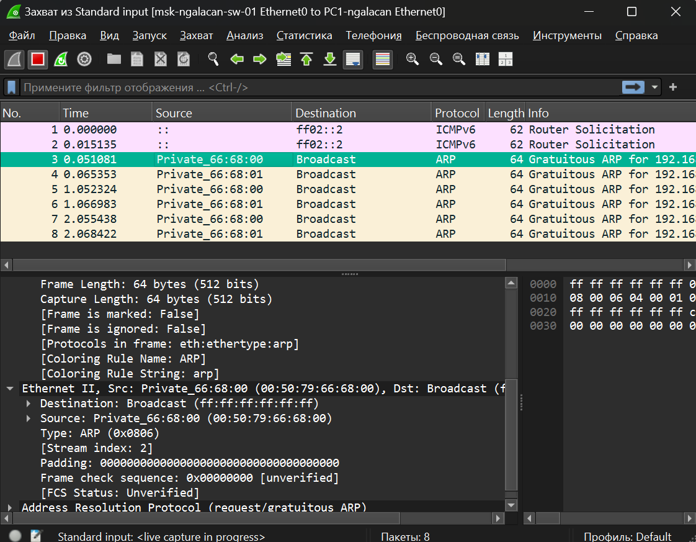{#fig:4 width=70%}

В терминале PC-2 просматриваю информацию по опциям команды `ping`. Делаю один эхо-запрос в ICMP-моде к PC-1, используя опцию `-1`: `ping 192.168.1.11 -1`. В окне Wireshark просматриваю захваченные пакеты. И в случае запроса, и в случае ответа длина кадра равняется 98 байт. В случае эхо-запроса точка назначения – PC-1, а
 источник – PC-2, в случае же эхо-ответа – наоборот (рис. [-@fig:5]).

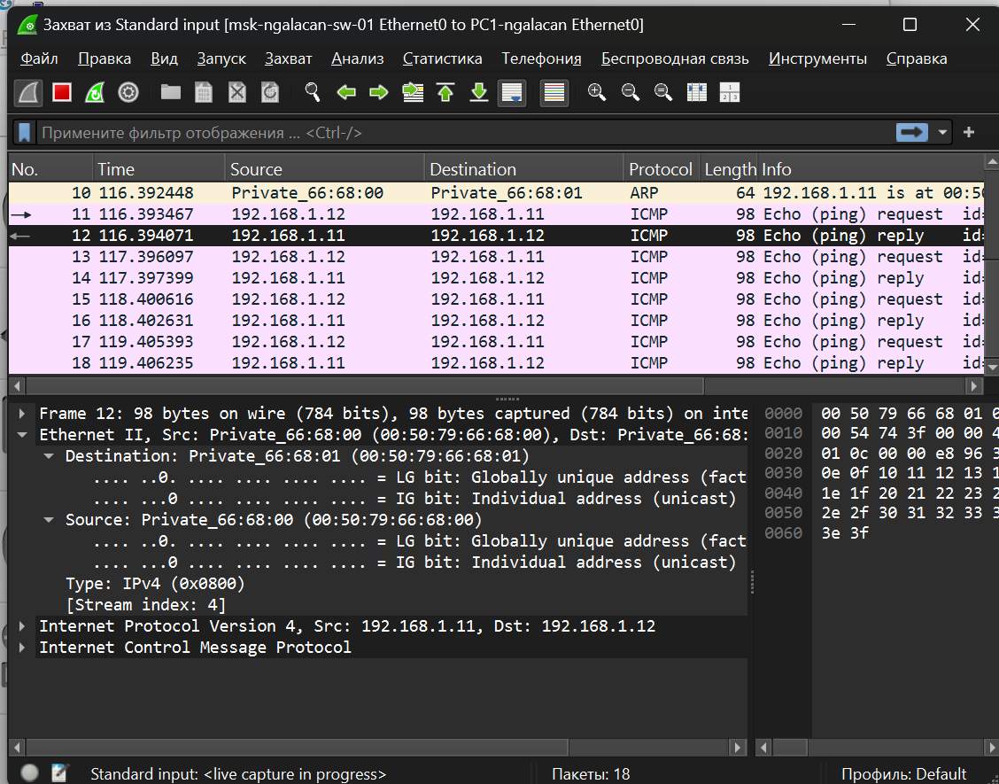{#fig:5 width=70%}

Делаю один эхо-запрос в UDP-моде к PC-1, используя опцию `-2`: `ping 192.168.1.11 -2`. В окне Wireshark просматриваю захваченные пакеты.  В поле сетевого уровня для эхо-ответа указан протокол UDP и IP
адреса источника (192.168.1.11) и получателя (192.168.1.12). В поле протокола UDP указаны порты источника (7) и получателя (57505) (рис. [-@fig:6]).

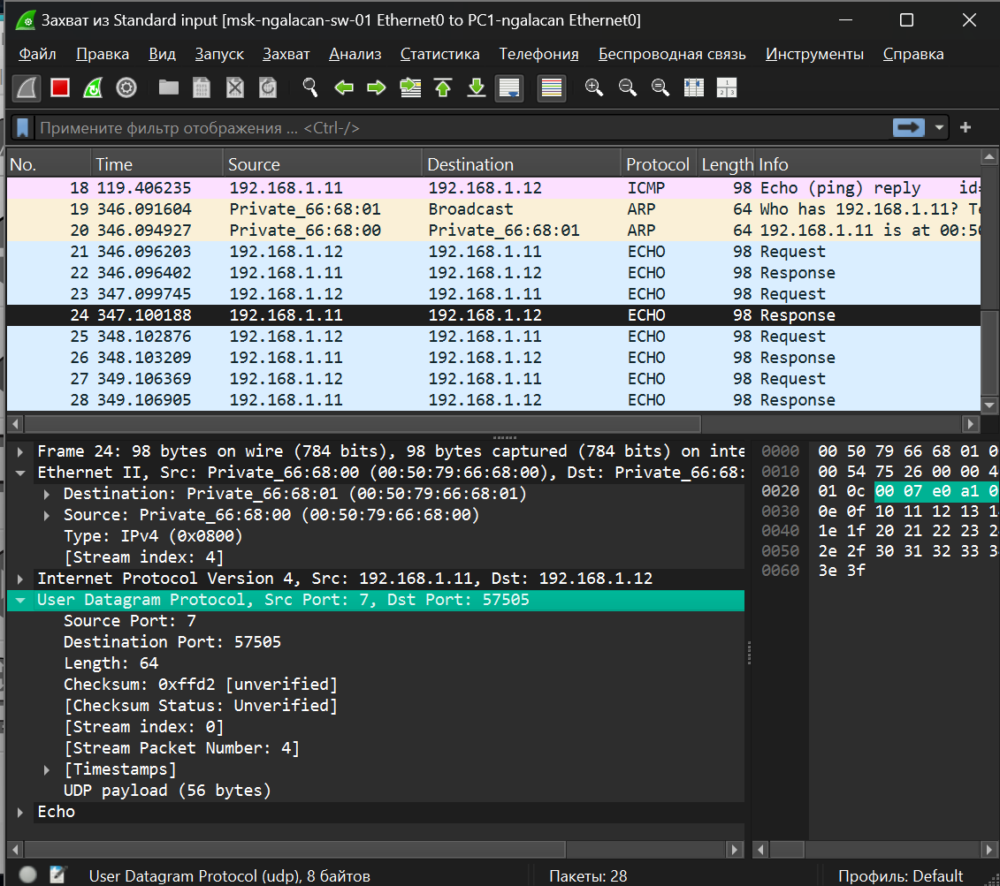{#fig:6 width=80%}

Делаю один эхо-запрос в TCP-моде к PC-1, используя опцию `-3`: `ping 192.168.1.11 -3`. В окне Wireshark просматриваю захваченные пакеты.  Порт источника задан случайно и равен 28929, порт назначения равен 7. В случае ответа порты заданы наоборот. Также можно увидеть handshake протокола TCP. В первом пакете установлен бит SYN. Во втором пакете установлены биты SYN и ACK. А в следующем пакете установлен бит ACK. Также есть пакеты с битом FIN,завершающим handshake (рис. [-@fig:7]). Останавливаю захват трафика.

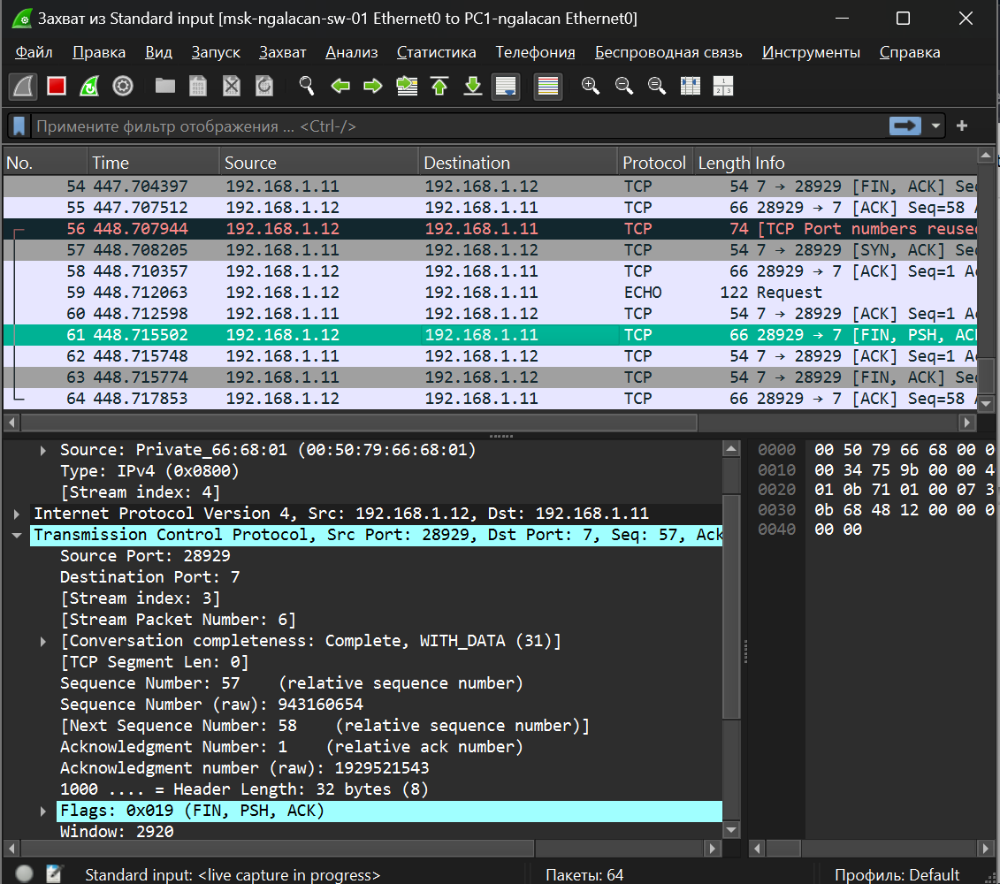{#fig:7 width=80%}

## Моделирование простейшей сети на базе маршрутизатора FRR в GNS3

**Постановка задачи**

1. Построить в GNS3 топологию сети, состоящей из маршрутизатора FRR, коммутатора Ethernet и оконечного устройства.
2. Задать оконечному устройству IP-адрес в сети 192.168.1.0/24.
3. Присвоить интерфейсу маршрутизатора адрес 192.168.1.1/24
4. Проверить связь.

Создаю новый проект. Размещаю VPCS, коммутатор Ethernet и маршрутизатор FRR, соединяю их, изменяю названия устройств на стандартные (рис. [-@fig:8]).

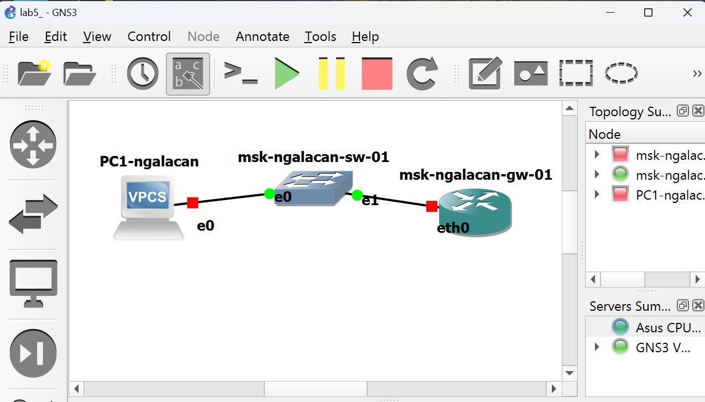{#fig:8 width=80%}

Включаю захват трафика между коммутатором и маршрутизатором. Запускаю устройства (рис. [-@fig:9]). Открываю консоли всех устройств проекта. Настраиваю IP-адресацию для РС-1, задав адрес `192.168.1.10` (рис. [-@fig:10]).

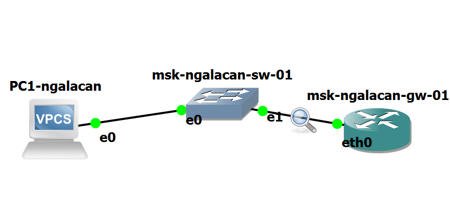{#fig:9 width=70%}

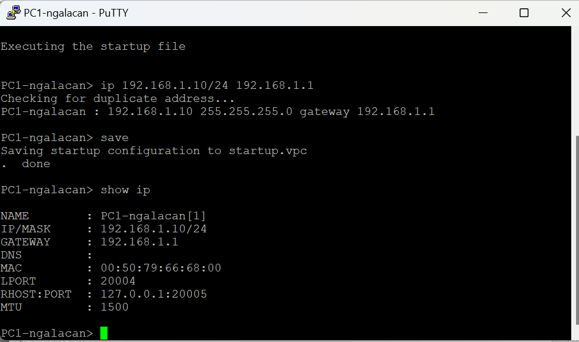{#fig:10 width=70%}

Настраиваю IP-адресацию для интерфейса локальной сети маршрутизатора, задав адрес `192.168.1.1` (рис. [-@fig:11]) и проверяю  (рис. [-@fig:12]).

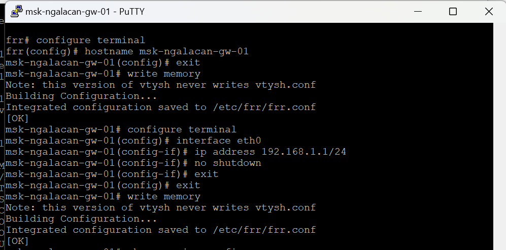{#fig:11 width=70%}

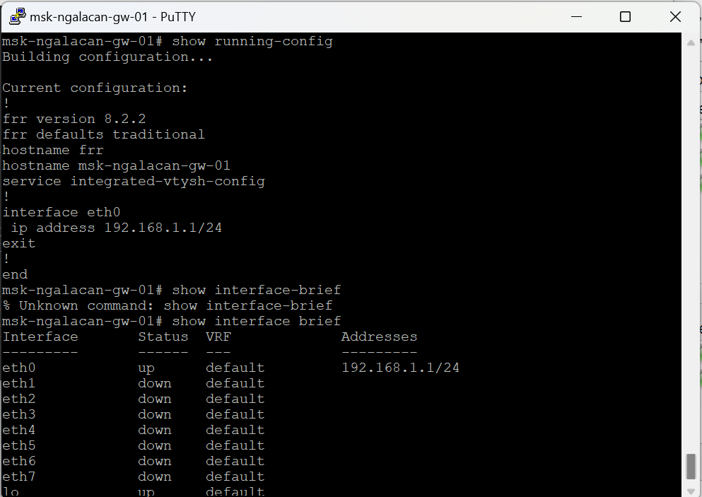{#fig:12 width=70%}

Проверяю подключение. Пингую адрес роутера с РС-1 (рис. [-@fig:13]). 

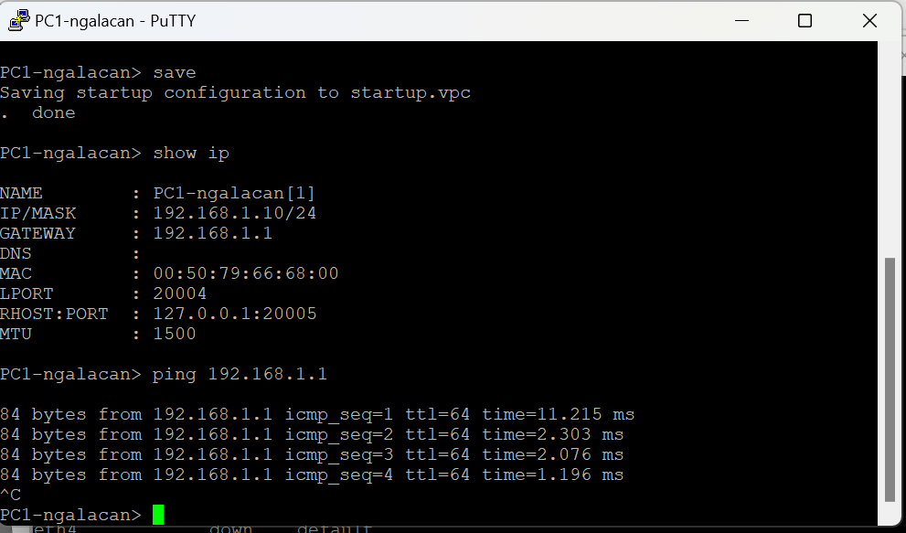{#fig:13 width=70%}

В окне Wireshark вижу захваченные пакеты (4 запроса и 4 ответа). В эхо-запросе источником является IP-адрес PC-1, а пунктом назначения – IP-адрес шлюза маршрутизатора. В эхо-ответе
наоборот. Также были сформированы ARP-пакеты, запрашивающие MAC-адрес шлюза маршрутизатора и PC-1 (рис. [-@fig:14]). В конце останавливаю захват трафика и все устройства в проекте.

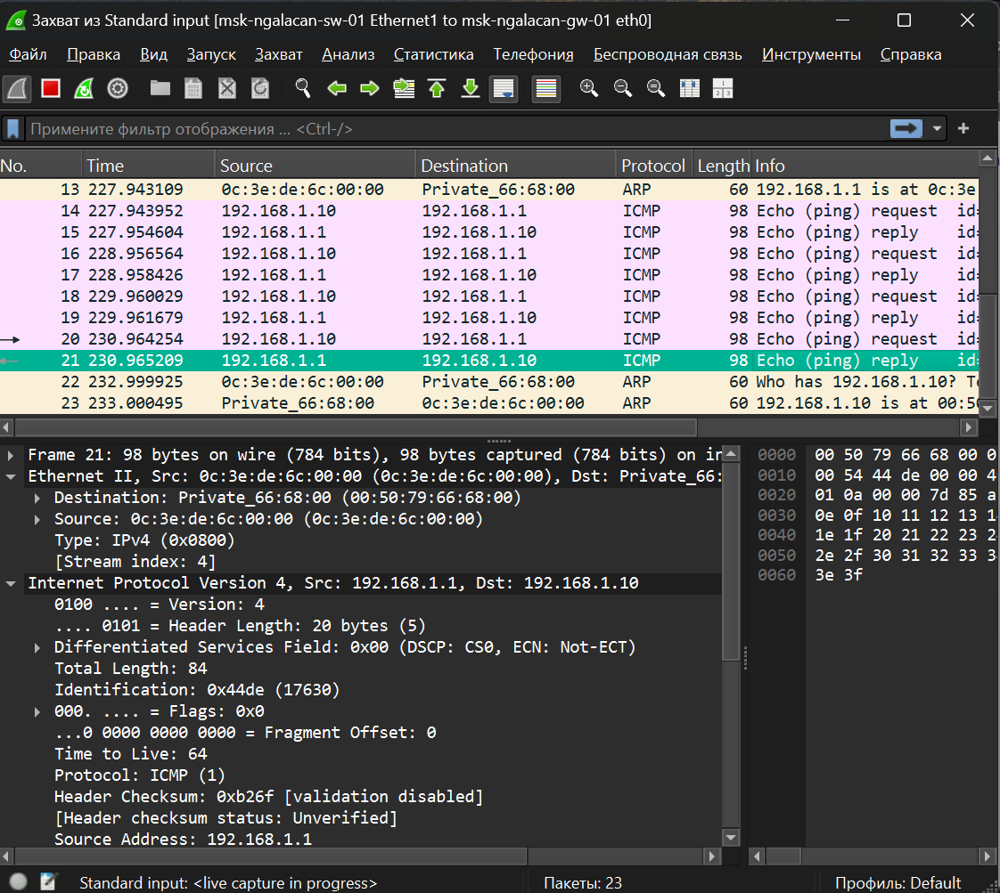{#fig:14 width=70%}

## Моделирование простейшей сети на базе маршрутизатора VyOS в GNS3

**Постановка задачи**

1. Построить в GNS3 топологию сети, состоящей из маршрутизатора VyOS, коммутатора Ethernet и оконечного устройства.

2. Задать оконечному устройству IP-адрес в сети 192.168.1.0/24.

3. Присвоить интерфейсу маршрутизатора адрес 192.168.1.1/24

4. Проверить связь.

Создаю новый проект. Размещаю VPCS, коммутатор Ethernet и маршрутизатор VyOS, соединяю их, изменяю названия устройств на стандартные. Включаю захват трафика между коммутатором и маршрутизатором. Запускаю устройства (рис. [-@fig:15]). 

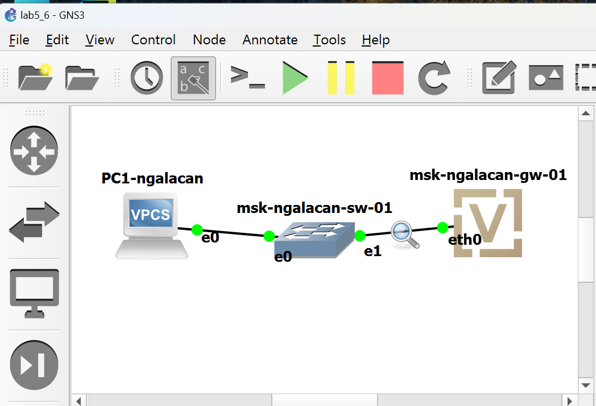{#fig:15 width=70%}

Настраиваю IP-адресацию для РС-1, задав адрес `192.168.1.10` (рис. [-@fig:16]).

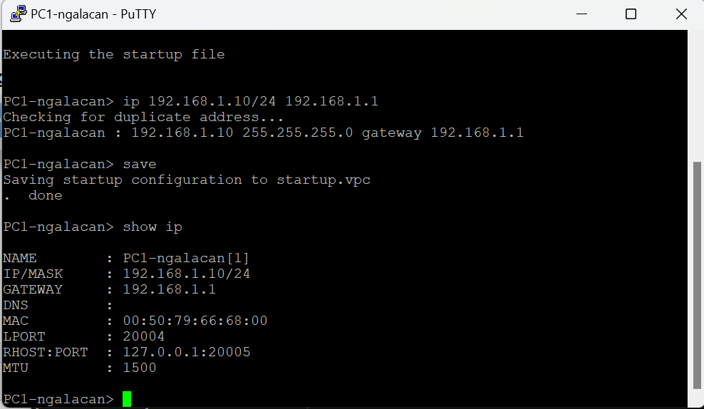{#fig:16 width=70%}

Настраиваю маршрутизатор VyOS. После загрузки ввожу с логином `vyos` и паролем `vyos`, устанавливаю систему на диск, перезагружаю. В режиме конфигурирования изменяю имя устройства, IP-адрес `192.168.1.1`, применяю изменения и просматриваю их (рис. [-@fig:17]).

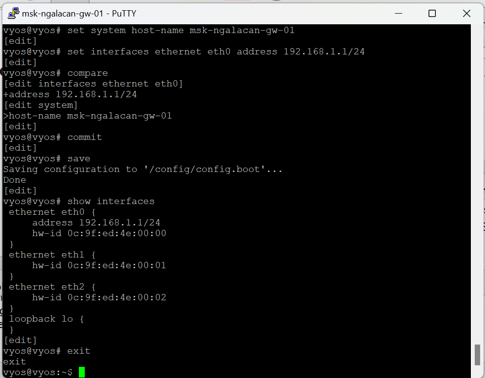{#fig:17 width=70%}

Проверяю подключение. Пингую адрес маршрутизатора с РС-1 (рис. [-@fig:18]). 

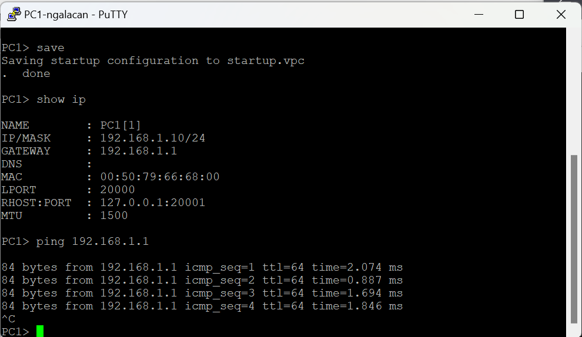{#fig:18 width=70%}

В окне Wireshark вижу захваченные пакеты (4 запроса и 4 ответа). В эхо-запросе источником является IP-адрес PC-1, а пунктом назначения – IP-адрес шлюза маршрутизатора. В эхо-ответе
наоборот. Также были сформированы ARP-пакеты, запрашивающие MAC-адрес шлюза маршрутизатора и PC-1 (рис. [-@fig:19]). В конце останавливаю захват трафика и все устройства в проекте.

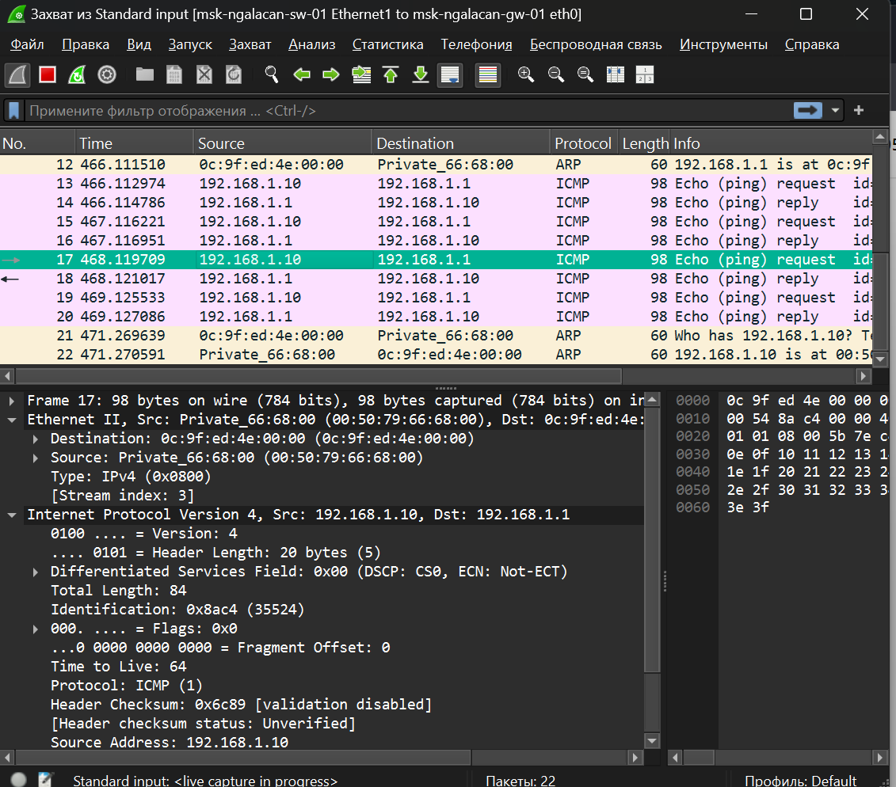{#fig:19 width=70%}

# Выводы

В результате выполнения работы было изучено построение простейших моделей сети на базе коммутатора и маршрутизаторов FRR и VyOS в GNS3, произведен анализ трафика посредством Wireshark.

