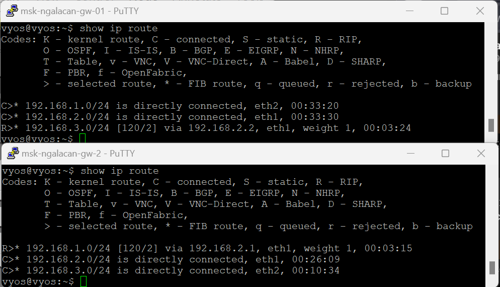

---
## Front matter
title: "Протокол маршрутизации RIP"
subtitle: "Сетевые технологии"
author: "Галацан Николай Ильич, НПИбд-01-22"

## Generic otions
lang: ru-RU
toc-title: "Содержание"

## Bibliography
bibliography: bib/cite.bib
csl: pandoc/csl/gost-r-7-0-5-2008-numeric.csl

## Pdf output format
toc: true # Table of contents
toc-depth: 2
lof: false # List of figures
lot: false # List of tables
fontsize: 12pt
linestretch: 1.5
papersize: a4
documentclass: scrreprt
## I18n polyglossia
polyglossia-lang:
  name: russian
  options:
	- spelling=modern
	- babelshorthands=true
polyglossia-otherlangs:
  name: english
## I18n babel
babel-lang: russian
babel-otherlangs: english
## Fonts
mainfont: IBM Plex Serif
romanfont: IBM Plex Serif
sansfont: IBM Plex Sans
monofont: IBM Plex Mono
mathfont: STIX Two Math
mainfontoptions: Ligatures=Common,Ligatures=TeX,Scale=0.94
romanfontoptions: Ligatures=Common,Ligatures=TeX,Scale=0.94
sansfontoptions: Ligatures=Common,Ligatures=TeX,Scale=MatchLowercase,Scale=0.94
monofontoptions: Scale=MatchLowercase,Scale=0.94,FakeStretch=0.9
mathfontoptions:
## Biblatex
biblatex: true
biblio-style: "gost-numeric"
biblatexoptions:
  - parentracker=true
  - backend=biber
  - hyperref=auto
  - language=auto
  - autolang=other*
  - citestyle=gost-numeric
## Pandoc-crossref LaTeX customization
figureTitle: "Рис."
tableTitle: "Таблица"
listingTitle: "Листинг"
lofTitle: "Список иллюстраций"
lotTitle: "Список таблиц"
lolTitle: "Листинги"
## Misc options
indent: true
header-includes:
  - \usepackage{indentfirst}
  - \usepackage{float} # keep figures where there are in the text
  - \floatplacement{figure}{H} # keep figures where there are in the text
---

# Введение

Протокол маршрутизации RIP (Routing Information Protocol) является одним из самых ранних и широко используемых протоколов динамической маршрутизации в компьютерных сетях. Разработанный в 1969 году, он стал основой для обмена маршрутной информацией между маршрутизаторами в локальных и глобальных сетях. RIP относится к классу протоколов, основанных на алгоритме векторного расстояния, что позволяет маршрутизаторам обмениваться информацией о доступных маршрутах и выбирать наиболее оптимальные пути для передачи данных.

Несмотря на свою простоту и легкость в реализации, RIP имеет свои ограничения, что делает его менее подходящим для крупных и сложных сетевых инфраструктур.

Для понимания роли RIP в современных сетевых технологиях и его отличия от других протоколов следует рассмотреть основные принципы работы протокола маршрутизации RIP, ограничения, преимущества и недостатки, а также области применения. 

# Принципы работы протокола RIP

## Динамическая маршрутизация и протоколы

Маршрутизаторы используют таблицы маршрутизации для принятия решений о переадресации пакетов данных. При использовании динамической маршрутизации формирование маршрутных таблиц производится маршрутизаторами автоматически в результате постоянного выполнения специального алгоритма маршрутизации. В процессе его выполнения маршрутизатор передаёт своим соседям информацию об известных ему маршрутах, получая от них взамен аналогичную информацию. После обработки полученной информации маршрутизатор строит заново или корректирует свою
таблицу маршрутизации [@nettech]. Это реализуется протоколами маршрутизации, в числе которых Route Information Protocol (RIP).

## Этапы работы протокола RIP

Работа протокола делится на несколько этапов.

**Этап 1**. Создание первичной таблицы маршрутизации. Маршрутизатор строит первичную таблицу маршрутизации, в которую помещает номера непосредственно подключённых сетей. Эта таблица содержит следующие поля:

- *Address* (Адрес) — адрес сети или узла назначения;
-  *Router* (Маршрутизатор) — сетевой адрес первого маршрутизатора
на маршруте к сети или узлу назначения;
- *Interface* (Интерфейс) — сетевой адрес или номер интерфейса связи с
первым маршрутизатором;
- *Metric* (Метрика) — числовая характеристика маршрута от 0 до 15
(значение 0 соответствует непосредственно подключённой сети, метрика 15 указывает на недостижимость сети или узла назначения, в остальных случаях — соответствует количеству промежуточных маршрутизаторов на маршруте к сети или узлу назначения);
- *Timer* (Таймер) — показатель актуальности информации о сети или узле назначения (если информация не подтверждается источником в течение установленного временного интервала, запись о маршруте удаляется из таблицы) [@nettech].

**Этап 2**. Рассылка минимальной таблицы соседям. После создания минимальных таблиц маршрутизатор начинает рассылать своим соседям сообщения протокола RIP. Сообщения, которые передаются в дейтаграммах UDP, включают в себя информацию о каждой сети: её IP-адрес и расстояние до неё от передающего маршрутизатора.

**Этап 3**. Получение RIP-сообщений от соседей и обработка полученной информации. Маршрутизатор после получения сообщений от соседних маршрутизаторов увеличивает каждое поле метрики на 1 и запоминает, через какой порт и от какого маршрутизатора получена информация, после чего сравнивает значения со своей таблицей.

**Этап 4**. Рассылка новой таблицы соседним маршрутизаторам.  Сконфигурированную таблицу маршрутизатор снова отправляет всем своим соседям. В ней хранится информация не только о сетях, к которым маршрутизатор подключен напрямую, но и о удаленных, о которых он узнал от соседних маршрутизаторов на втором этапе.

**Этап 5**. Получение таблиц и обработка полученной информации. Аналогично этапу №3: маршрутизатор получает таблицы маршрутизации от соседних устройств и сравнивает со своей, внося изменения в конфигурацию в соответствии с реальной топологией сети. [@habr]

Пакеты данных маршрутизаторы перенаправляют в соответствии с таблицей маршрутизации: маршрутизатор получает пакет, проверяет таблицу и отправляет пакет на соответствующий порт. Однако для сетей характерны постоянные изменения (меняются маршрутизаторы, перестраиваются линии связи, создаются новые подсети и уничтожаются невостребованные). Для бесперебойной работы сети при внесении изменений RIP использует ряд механизмов [@merionet].

## Адаптация к изменениям в сети

Маршрутизаторы, работающие по протоколу RIP, эффективно адаптируются к появлению новых маршрутов. Они передают актуальную информацию о маршрутах своим соседям в процессе регулярного обмена сообщениями, что позволяет постепенно распространить эти данные среди всех маршрутизаторов в сети. Однако управление потерей существующих маршрутов представляет собой более сложную задачу. Это обусловлено отсутствием в формате сообщений протокола RIP поля, указывающего на недоступность определенного маршрута.

Для уведомления о недействительности маршрута используется механизм истечения времени жизни маршрута. Этот механизм основывается на том, что обмен таблицами маршрутизации в протоколе RIP осуществляется каждые 30 секунд, тогда как время тайм-аута составляет шесть раз больше — 180 секунд. При получении сообщения с подтверждением записи маршрута маршрутизатор сбрасывает таймер в исходное состояние. Если в течение времени тайм-аута (180 секунд) повторное подтверждение не поступает, маршрут считается недействительным.

Шестикратное время тайм-аута необходимо для обеспечения уверенности в том, что маршрут действительно недоступен, а не просто произошла потеря пакетов, что может случиться из-за использования транспортного протокола UDP [@habr].

## Защита от циклических маршрутов

Для предотвращения циклических маршрутов в алгоритмах маршрутизации Distance-Vector вообще и RIP в том числе используются несколько методов:

1. *Правило расщеплённого горизонта (Split Horizon)*: Запрещает включение информации о маршруте, полученной от маршрутизатора, в обновления, отправляемые этому маршрутизатору. Это помогает избежать циклических маршрутов между соседними маршрутизаторами и снижает объем неинформативной информации в обновлениях. Однако это правило не эффективно при наличии циклов с несколькими маршрутизаторами.

2. *Правило отравленного обратного пути (Poison Reverse)*: Похожее на предыдущее правило, но включает информацию о маршруте с метрикой 16 в обновления, отправляемые маршрутизатору. Это позволяет быстро удалить потенциально опасные маршруты из таблицы маршрутизации.

3. *Метод управляемых обновлений (Triggered Update)*: Позволяет маршрутизатору отправлять обновления сразу после изменения своей таблицы маршрутизации, без ожидания периодических обновлений. Это обеспечивает мгновенное распространение информации об изменениях по сети и ограничивает распространение обновлений только в нужных направлениях [@nettech].

# Ограничения протокола RIP

Протокол маршрутизации RIP имеет ряд ограничений, которые ограничивают
его применимость в современных сетях.

1. **Медленная сходимость**. RIP использует периодические обновления каждые 30 секунд по умолчанию.
Это означает, что он может медленно реагировать на изменения в сети. В больших
сетях или сетях с высокой динамикой изменений это может привести к медленной
сходимости, что не всегда приемлемо для современных требований к сетевой
производительности.

2. **Ограниченная поддержка переменных метрик**. RIP использует только одну метрику - количество хопов (прыжков) - для определения стоимости маршрута. Это делает его неэффективным в сетях с
разнообразными типами связи и разными критериями качества обслуживания.

3. **Ограниченное количество маршрутов**. RIP ограничивает количество маршрутов, которые могут храниться в таблице маршрутизации, до 15 маршрутов.

4. **Отсутствие поддержки классов обслуживания**. RIP не учитывает классы обслуживания или различные требования к обработке данных. Не учитывается приоритет обслуживания.

5. **Низкая отказоустойчивость**. RIP не обладает механизмами высокой отказоустойчивости. В случае сбоя
одного из маршрутизаторов, процесс обновления маршрутной информации может
занять значительное время, что может привести к временным проблемам в сети.

Выводя итог, протокол маршрутизации RIP имеет свои ограничения и
ограниченную применимость в современных сетях, но несмотря на это, может быть полезным в
небольших и простых сетях, где требуется простота настройки и управления.

# Демонстрация работы протокола RIP в GNS3

Для демонстрации работы протокола была создана простейшая сеть, состоящая из двух узлов VPCS и двух маршрутизаторов VyOS  (рис. [-@fig:1]).

{#fig:1 width=70%}

Адресация в данной сети построена в соответствии с табл. [-@tbl:route-table].

: Таблица адресации {#tbl:route-table}

| Устройство | Интерфейс | IPv4-адрес      | Шлюз по умолчанию |
|------------|-----------|-----------------|-------------------|
| gw-01      | eth1      | 192.168.2.1/24  |                   |
| gw-01      | eth2      | 192.168.1.1/24  |                   |
| gw-02      | eth1      | 192.168.2.2/24  |                   |
| gw-02      | eth2      | 192.168.3.1/24  |                   |
| PC-1       | NIC       | 192.168.1.10/24 | 192.168.1.1       |
| PC-2       | NIC       | 192.168.3.10/24 | 192.168.3.1       |

Произвожу настройку маршрутизаторов и интерфейсов (рис. [-@fig:2]) и конечных узлов, назначив им IP-адреса в соответствии с таблицей.

{#fig:2 width=70%}

После этого пробую с PC-1 проверить подключение к РС-2 с помощью `ping` и наоборот, но вижу, что сеть назначения недостижима, так как маршрутизатору она неизвестна (рис. [-@fig:3]).

{#fig:3 width=70%}

Настраиваю протокол RIP на интерфейсах первого маршрутизатора (рис. [-@fig:4]), аналогично подключаю протокол на втором.

{#fig:4 width=70%}

Использую `show ip route` для проверки таблиц маршрутизации, созданных на каждом маршрутизаторе протоколом RIP. Теперь каждый маршрутизатор знает обо всех 3 сетях (рис. [-@fig:5]).

{#fig:5 width=70%}

Пингую РС-2 с РС-1 и наоборот чтобы убедиться, что сети достижимы (рис. [-@fig:6]).

{#fig:6 width=70%}

Использование RIP позволило передать пакеты от одного конечного узла ко второму несмотря на то, что они находятся в разных сетях, при этом не пришлось вручную создавать таблицы адресации.

# Преимущества и недостатки RIP

## Преимущества

1. **Простота настройки и управления**. Один из ключевых плюсов RIP - это его простота. RIP легко настраивается и управляется, что делает его привлекательным выбором для малых и небольших
сетей, где нет необходимости в сложных конфигурациях.

2. **Широкая поддержка в сетевом оборудовании**. RIP является одним из старейших и наиболее распространенных протоколов
маршрутизации. Множество сетевых устройств и маршрутизаторов поддерживают
RIP, что обеспечивает высокую совместимость.

3. **Стабильная работа в небольших сетях с низкой нагрузкой**. В небольших сетях с ограниченным количеством маршрутов и низкой
нагрузкой на сеть RIP может хорошо справляться с задачей определения
оптимальных маршрутов. Его ограниченная метрика (количество хопов) может
быть достаточной для таких сред.

## Недостатки

1. Отсутствие поддержки спецификации CIDR. RIP-I воспринимает подсети, такие как `10.1.0.0/16` и `0.2.0.0/16`, как одну большую сеть класса A (`10.0.0.0/8`) и создает для нее только один маршрут. Это приводит к потере пакетов, которые направляются в эти подсети. Во второй версии протокола этот недостаток был исправлен, добавив в маршрутную информацию маску сети (SUBNET MASK), что позволило лучше обрабатывать такие адреса [@nettech].

2. Необходимость долгого восстановления связи после сбоя в маршрутизаторе.

3. Возможно возникновение циклов.

# Заключение

Протокол маршрутизации RIP - это важный
элемент сетевой инфраструктуры, который, несмотря на свой возраст и
ограничения, продолжает оставаться актуальным и полезным в определенных
сетевых сценариях. В данном докладе были рассмотрены ключевые аспекты
работы RIP, его преимущества и недостатки.

RIP предлагает простоту настройки и управления, что делает его
привлекательным выбором для малых и небольших сетей. Он также широко
поддерживается сетевым оборудованием и остается важным объектом изучения
сетевой маршрутизации, особенно для начинающих специалистов.

Однако RIP также обладает своими ограничениями, которые делают его
несостоятельным в больших и сложных сетях. Следует отметить, что в современных сетях чаще используются более
мощные и гибкие протоколы маршрутизации, такие как OSPF (Open Shortest Path
First) и BGP (Border Gateway Protocol), которые позволяют более точно управлять
сетевой инфраструктурой и обеспечивают высокую производительность и
отказоустойчивость [@merionet].

Тем не менее, понимание работы RIP остается важным для сетевых
специалистов, так как это обеспечивает базовые знания о маршрутизации и может
быть полезным в небольших сетях или в образовательных целях. В конечном итоге
выбор протокола маршрутизации зависит от конкретных требований сети и целей.

# Список литературы{.unnumbered}

::: {#refs}
:::
